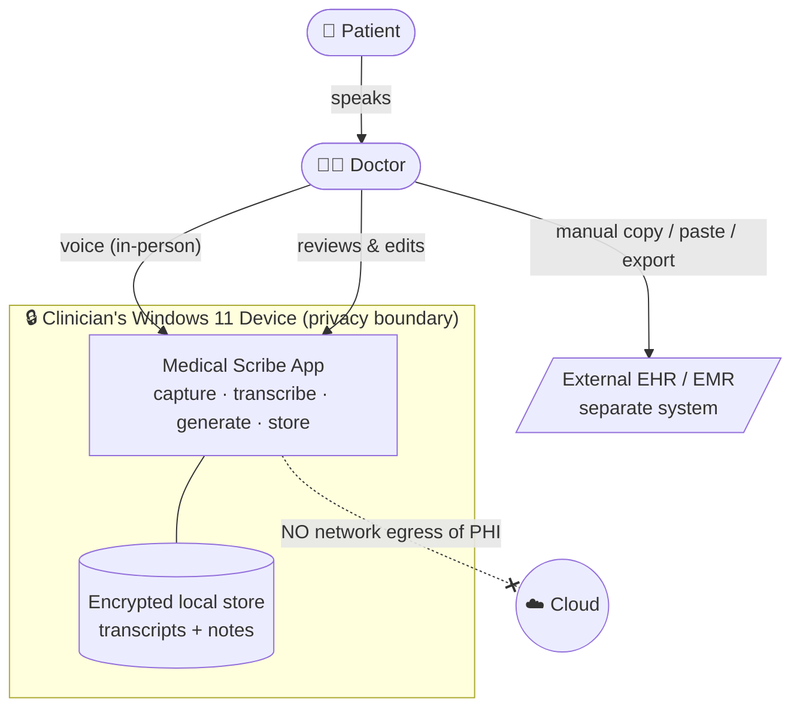
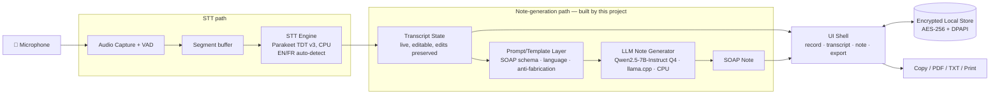
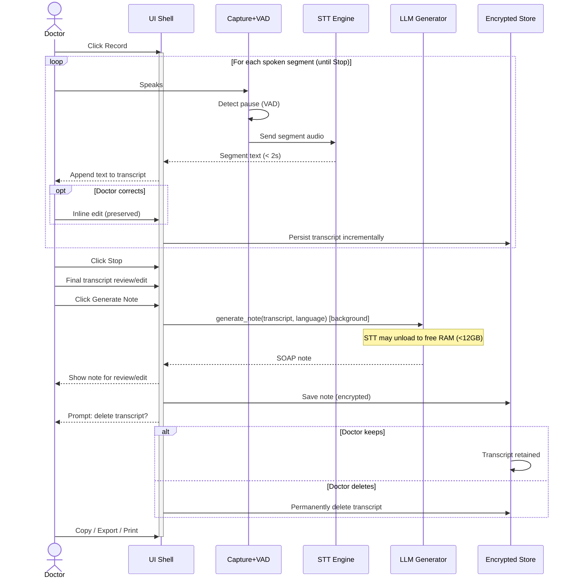
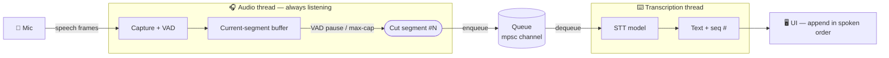

# Medical Scribe — System Design

> An on-device application that records doctor–patient conversations, transcribes them locally, and generates structured SOAP clinical notes — with no patient data ever leaving the clinician's Windows device.

## Table of Contents

1. [Overview](#1-overview)
2. [Functional Requirements](#2-functional-requirements)
3. [Non-Functional Requirements](#3-non-functional-requirements)
4. [Architecture & Model Selection](#4-architecture--model-selection)
5. [Diagrams](#5-diagrams)
6. [Speech-to-Text Pipeline](#6-speech-to-text-pipeline)
7. [Model Residency Strategy](#7-model-residency-strategy)
8. [Note Generation (LLM)](#8-note-generation-llm)
9. [Data Model & Interfaces](#9-data-model--interfaces)
10. [Security & Compliance](#10-security--compliance)
11. [Trade-offs & Alternatives](#11-trade-offs--alternatives)
12. [Pricing](#12-pricing)
13. [Future Considerations](#13-future-considerations)

---

## 1. Overview

### Problem statement

Clinicians lose significant time to documentation — writing up each encounter during or after the visit pulls attention away from the patient and extends the working day. Existing AI scribe products are cloud-based, which raises privacy/compliance concerns under Canadian law (PHIPA/PIPEDA) and locks small clinics into recurring per-seat subscriptions.

This product lets the doctor focus on **one thing — treating the patient** — while the application handles documentation. It is **cost-effective** (no per-seat cloud subscription) and **fully private**: all audio capture, transcription, and note generation run on the clinician's own device. A single-tenant VPS dedicated to one clinic is offered as a secondary deployment option for clinics that prefer it, with no shared multi-tenant cloud at any point.

### Goals (in scope for v1)

- Capture doctor–patient conversation audio on the clinician's Windows device for **in-person** consults.
- Transcribe the conversation locally (speech-to-text), supporting **English and French** (Canada).
- Generate a structured **SOAP clinical note** from the transcript, fully on-device.
- Keep the transcript locally so the doctor can revisit it; the doctor can delete transcripts at any time.
- Run entirely on commodity clinician hardware: **Windows 11, 16–32 GB RAM, no GPU (CPU-only inference)**.

### Non-goals (explicitly out of scope for v1)

- **No EMR/EHR integration** — the doctor copies the note manually into their chart.
- **No billing codes, ICD-10-CA codes, orders, or referrals** — deferred to a future phase.
- **No online/telehealth consults** — v1 captures in-person visits only (loopback/system-audio capture deferred to a future phase).
- No clinical decision support, diagnosis, or treatment advice — the tool documents, it does not advise.
- No shared multi-tenant cloud, cross-device sync, or central admin console.
- No languages beyond English and French.

### Key assumptions & constraints

- **Single clinician per device**, one encounter at a time (no parallel rooms on one machine).
- Target hardware: **Windows 11, 16–32 GB RAM, CPU-only** (no dedicated GPU). This is the binding constraint on model selection and on whether transcription is real-time vs. post-encounter.
- In-person capture uses a **single microphone** picking up both doctor and patient in the same room.
- **Human-in-the-loop:** the doctor reviews and edits every note; the tool never auto-files anything.
- **Audio is processed, not permanently retained**; the **transcript is retained locally** until the doctor deletes it.
- Market: **Canada** — PHIPA/PIPEDA govern handling of personal health information.

---

## 2. Functional Requirements

The system works like a dictation tool tuned for a clinical visit. While the doctor records, the app transcribes **incrementally**: each time the speaker pauses, the just-spoken segment is transcribed and appended to the on-screen transcript, which the doctor can correct inline at any time (they speak and edit at different moments, never simultaneously). The core loop: **record → see text appear segment-by-segment, editing as needed → Stop → final transcript review → click Generate → review/edit the SOAP note → export → clear**. Note generation is **explicit (on click)**, after the doctor is happy with the transcript. Capabilities are prioritized P0 (must-have for v1), P1 (should-have), P2 (deferred/future).

### Capabilities

| # | Capability | Priority | Actor | Trigger | Behavior | Success outcome |
|---|-----------|----------|-------|---------|----------|-----------------|
| FR-1 | **Start/stop recording** | P0 | Doctor | Clicks "Record" at visit start, "Stop" at end | Continuously captures microphone audio for the in-person encounter; shows elapsed time and a recording indicator | A live, growing transcript and a final transcript on Stop |
| FR-2 | **Incremental (segmented) transcription** | P0 | System | Doctor pauses speaking (silence/VAD-detected gap) | Transcribes the just-spoken segment locally and **appends it to the on-screen transcript immediately**, then continues listening for the next segment. Auto-detects English or French | Doctor sees captured text appear segment-by-segment during the visit, with no perceptible wait |
| FR-3 | **Inline transcript editing during capture** | P0 | Doctor | Doctor edits displayed text while not speaking | Doctor can correct any already-captured text inline; the correction is treated as final. New speech is **appended after** existing text and never overwrites a manual edit | Doctor's corrections persist; transcript stays accurate as the visit proceeds |
| FR-4 | **Pause/resume recording** | P1 | Doctor | Clicks "Pause" mid-visit | Suspends capture (e.g. patient steps out, private moment) and resumes into the same transcript | Audio excludes paused segments; single continuous transcript |
| FR-5 | **Language auto-detect + override** | P0 | System / Doctor | On each segment | Detects spoken language (EN/FR) automatically; doctor can override if mis-detected | Transcript and note produced in the correct language |
| FR-6 | **Final transcript review & edit** | P0 | Doctor | After Stop, before generating | Doctor sees the full assembled transcript as a single paragraph and may do a final edit | A doctor-approved transcript ready for note generation |
| FR-7 | **Generate SOAP note (on click)** | P0 | Doctor / System | Doctor clicks "Generate Note" | Local LLM produces a structured note with Subjective / Objective / Assessment / Plan sections from the (possibly edited) transcript | A clean, correctly-sectioned SOAP note in the encounter's language |
| FR-8 | **Review & edit note** | P0 | Doctor | Note displayed | Doctor reads and freely edits any section before use (human-in-the-loop; nothing is auto-filed). May go back, edit the transcript, and regenerate if the note is badly wrong | Doctor-approved note text |
| FR-9 | **Copy to clipboard** | P0 | Doctor | Clicks "Copy" | Copies the formatted SOAP note as text for pasting into any EHR | Note on clipboard, ready to paste |
| FR-10 | **Export PDF / TXT** | P0 | Doctor | Clicks "Export" | Saves the note (and optionally the transcript) as a PDF or plain-text file to a local path the doctor chooses | File written locally, owned by the doctor |
| FR-11 | **Print note** | P1 | Doctor | Clicks "Print" | Sends the formatted note to the system print dialog | Printed note |
| FR-12 | **Mic device selection & level check** | P1 | Doctor | Before/at recording | Choose input device and see a live input-level meter to confirm audio is being captured | Confidence that the right mic is working before the visit |
| FR-13 | **Browse & reopen saved encounters** | P1 | Doctor | Opens the saved-encounters list | Lists previously saved encounters (timestamp/label) and lets the doctor reopen a transcript/note to view, edit, re-export, or delete | Doctor can return to past notes without an external system |

### Session & retention model

- **Transcripts and notes are persisted locally inside the application** and remain available across sessions until the doctor deletes them. The app keeps a local store of past encounters the doctor can revisit.
- **Audio is transient**: held only long enough to transcribe each segment, then discarded. Audio is never written to disk as a retained file.
- After a note is generated, the app shows a **pop-up offering to delete the transcript**. If the doctor declines, the transcript stays in the app; the note is always kept. The doctor can later delete the transcript and/or the note independently, at any time.
- All persisted PHI (transcripts and notes) is **encrypted at rest** (see NFRs) so a lost or stolen device does not expose patient data.
- The doctor may also **export** (PDF/TXT) to keep copies outside the app; those exported files are theirs to manage.

### Edge cases & explicit out-of-scope behaviors

- **Very long visits** (approaching/over ~20 min): transcription must handle long audio without running out of memory (chunked processing — see NFRs).
- **Silence / no speech**: produce an empty or "insufficient audio" result rather than a hallucinated note.
- **Mixed EN/FR in one visit**: best-effort; auto-detect picks the dominant language. Robust code-switching is **not** guaranteed in v1.
- **Background noise / overlapping speech**: best-effort transcription. **Speaker diarization (labeling Doctor vs Patient) is deferred to P2** — v1 produces a single transcript and the LLM infers roles from conversational context when writing the note.
- **Out of scope:** EMR write-back, billing/diagnosis codes, online/telehealth capture, clinical advice, multi-clinician on one device, languages other than EN/FR.

---

## 3. Non-Functional Requirements

All targets are for the **binding hardware profile**: Windows 11, 16 GB RAM (32 GB upper), **CPU-only, no GPU**. Numbers are design targets to validate during benchmarking, not guarantees, given on-device model variability.

| # | Requirement | Target | Rationale |
|---|------------|--------|-----------|
| NFR-1 | **Per-segment transcription latency** | Captured text appears **< 2 s** after a speech pause (for a typical 5–15 s utterance) | Must feel near-instant so the doctor isn't waiting mid-visit; drives choice of a fast, CPU-light STT model (Parakeet TDT v3, §6.4) |
| NFR-2 | **Note generation** | Runs in a **background queue**; doctor is not blocked and can start the next patient. Target completion **< 90 s** for a ~20-min encounter on the 16 GB profile | A 7–8B quantized LLM on CPU needs time; backgrounding hides it so throughput isn't affected |
| NFR-3 | **Throughput** | Up to **50 encounters/device/day**, processed **sequentially** (one active encounter at a time) | Matches a busy walk-in/solo clinic peak day; no concurrency required |
| NFR-4 | **Encounter length** | Handle encounters up to **~30 min** of audio without instability | Headroom over the ~20-min average; long visits must not exhaust memory |
| NFR-5 | **Peak memory** | Total app + models peak **< 12 GB RAM** | Leaves ~4 GB for Windows + the doctor's EHR/browser on a 16 GB machine; STT + LLM may need to load/unload to coexist |
| NFR-6 | **Privacy / data residency** | **Zero network egress of PHI.** App is fully functional **offline**; no telemetry containing PHI; no third-party cloud calls | Core product promise and PHIPA/PIPEDA posture |
| NFR-7 | **Encryption at rest** | All persisted PHI (transcripts, notes, app store) **encrypted at rest** (AES-256; key protected via Windows DPAPI tied to the user account) | Persistent local PHI must survive device loss/theft without exposure |
| NFR-8 | **Durability / crash safety** | Captured transcript persisted incrementally so an app/OS crash mid-visit loses **≤ the last unsaved segment** | A 20-min visit's transcript must not vanish on a crash |
| NFR-9 | **Data lifecycle** | Audio discarded immediately after each segment is transcribed; transcript/note retained until the doctor deletes them; deletions are **permanent** (no recycle/cloud copy) | Minimizes audio PHI footprint; gives the doctor full control over retained text |
| NFR-10 | **Note quality** | No hard WER SLA in v1. Commit: **all SOAP sections populated only from transcript facts, no fabricated content**; **mandatory human review** before use | Honest given CPU-model limits; safety comes from the human-in-the-loop, not model perfection |
| NFR-11 | **Availability** | N/A as a service (local desktop app); target **no crash** across a full clinic day; graceful recovery on restart | It's a local app, but it must be dependable across 50 visits |
| NFR-12 | **Install & footprint** | Single Windows installer; models bundled or fetched once on first run; on-disk footprint **target < 10 GB** (STT + LLM weights) | Must be deployable by a non-technical clinic on a normal laptop |
| NFR-13 | **Cold start** | App ready to record **< 10 s** from launch (models may lazy-load on first record) | Doctor can't wait minutes between patients |
| NFR-14 | **Maintainability** | STT and LLM are **swappable** behind internal interfaces so models can be upgraded without rewrites | On-device model landscape moves fast; avoid lock-in to one model |
| NFR-15 | **Licensing** | All bundled models and runtimes must be **free for commercial use** (permissive OSS, ideally Apache-2.0/MIT) with **no per-seat fees or usage caps** | Core "no subscription / cost-effective" value prop; avoids legal/cost risk from restrictive model licenses |

---

## 4. Architecture & Model Selection

### Component overview

The application is a single Windows desktop process composed of swappable building blocks. The **STT path is treated as an existing, already-solved component** (the developer is integrating a known open-source speech-to-text codebase); the design's primary engineering focus is the **note-generation path**.

| Component | Responsibility | Choice / status |
|-----------|----------------|-----------------|
| **Audio capture** | Read microphone, buffer PCM, detect speech pauses (VAD) to segment utterances | Part of the existing STT codebase being integrated |
| **STT engine** | Transcribe each audio segment to text; EN/FR auto-detect | **Parakeet TDT 0.6B v3**, CPU-only via an ONNX runtime; multilingual EN+FR with auto-detect. Single STT engine for v1 (see §6.4) |
| **Transcript store** | Hold the live, editable transcript; persist per-encounter; preserve manual edits | App-owned; encrypted local store (see Data Model) |
| **Note generator (LLM)** | Turn the approved transcript into a structured SOAP note (EN/FR), on click | **Local 7–8B instruct model, 4-bit GGUF, via `llama.cpp`.** Default **Qwen2.5-7B-Instruct (Apache-2.0)**; alternate **Mistral-7B-Instruct v0.3 (Apache-2.0)** |
| **Prompt/template layer** | SOAP system prompt, section schema, language handling, anti-fabrication guardrails | App-owned; the main thing this project must build well |
| **Local store** | Encrypted persistence of transcripts + notes; saved-encounter list | App-owned (see Data Model) |
| **UI shell** | Record controls, live transcript, note view/edit, export/print, saved list | Desktop framework **TBD** alongside the STT codebase decision |

### Model selection — note generator (the focus of v1)

- **Runtime:** `llama.cpp` (GGUF), CPU inference, 4-bit quantization (Q4_K_M) to fit memory and hit latency.
- **Default model:** **Qwen2.5-7B-Instruct** — Apache-2.0 (commercially free, no caps), strong instruction-following for structured output, solid French.
- **Alternate:** **Mistral-7B-Instruct v0.3** — Apache-2.0, lighter/faster, strong French; fallback if Qwen is too slow on low-end CPUs.
- **Explicitly avoided:** Llama-3.x (Meta Community License) and Gemma (Gemma license) — usable but carry usage terms; excluded to keep the licensing story clean (NFR-15).
- **Swappable interface:** the note generator sits behind an internal `generate_note(transcript, language) -> SOAP` interface so the model can be upgraded or A/B-tested without touching the rest of the app (NFR-14).

### Memory coexistence note

To respect the **<12 GB peak** target (NFR-5), the STT model and the LLM are **not required to be resident simultaneously**. STT is active during recording; the LLM is loaded for the on-click generation step. If memory is tight, the app can unload STT before loading the LLM (acceptable because generation is an explicit, post-recording step). This is a key reason note generation is on-click and backgrounded rather than continuous.

### Deployment models

1. **Primary — fully on-device:** everything runs on the clinician's Windows 11 machine. No network dependency for core function.
2. **Secondary — single-tenant VPS:** for clinics preferring not to run models on the local laptop, one dedicated VPS per clinic hosts the same app/models, accessed only by that clinic. Still no shared multi-tenant cloud; PHI stays within the clinic's dedicated instance. (Detailed in Trade-offs.)

---

## 5. Diagrams

Diagrams are split by concern. The recurring theme: **the device boundary is the privacy boundary** — no PHI crosses it.

### 5.1 System context

Shows who uses the app and the hard boundary of the clinician's device. The only external system is the EHR, reached **manually** via clipboard/file by the doctor — the app never talks to it.



### 5.2 Component diagram

The internal building blocks (Section 4). The STT path is the existing OSS component; the note-generation path is what this project primarily builds.



### 5.3 Sequence — live capture → note generation

The core runtime flow: incremental transcription during the visit, then on-click note generation, then the delete-transcript prompt.



---

## 6. Speech-to-Text Pipeline

This section details the on-device speech-to-text (STT) subsystem — the path from raw microphone input to editable transcript text. It is implemented in the **Rust backend** of the Tauri application and runs entirely locally. The pipeline is described as a sequence of discrete stages; this subsection covers the first.

### 6.1 Audio capture

The capture stage turns live microphone input into a clean, uniform audio signal that the rest of the pipeline can rely on. It records **all** incoming sound — deciding what is speech versus silence is a later stage (VAD, §6.2), not capture's job.

**Design:**

- **Dedicated capture thread.** Audio capture runs on its own thread inside the app process (not a separate process), parallel to the UI. Its single job is to pull audio frames from the microphone as they arrive and forward them downstream over a thread-safe channel (mpsc). Isolating capture on its own thread guarantees that UI work (rendering, button clicks) can never stall capture and cause dropped audio. The thread is active for the duration of a recording and parked when idle.
- **Cross-platform audio I/O via `cpal`.** The app opens the OS default or a user-selected input device and reads its **native format** — whatever sample type (e.g. `u8`, `i16`, `f32`), sample rate, and channel count the hardware happens to provide.
- **Normalize to a uniform signal.** Every captured sample is converted to **32-bit float (`f32`)**, and the stream is **resampled to 16 kHz mono** (via `rubato`). This is the canonical input format STT models expect:
  - *`f32`* — one uniform numeric format downstream, normalized to the −1.0…+1.0 range, avoiding precision loss in subsequent math.
  - *16 kHz* — human speech information lives below ~8 kHz; by the Nyquist limit, 16 kHz sampling captures all of it. Higher rates (44.1/48 kHz) only add data the model doesn't need, increasing compute for no accuracy gain. 16 kHz is the minimum rate that fully preserves speech.
  - *mono* — a single combined channel; stereo is redundant for transcribing speech and doubles the data.

  Normalization changes only the *format/resolution* of the audio, never its content — all sounds (voices, noise, silence) are still present, just represented efficiently.
- **Live input-level feedback.** A lightweight tap on the capture stream computes the current input amplitude and pushes it to the UI to drive a live waveform / volume meter. This is purely UX — it lets the clinician confirm the microphone is live and picking up sound **before** committing a full visit to recording (supports FR-12). It has no effect on transcription accuracy.

**Decisions:**

| Decision | Choice | Rationale |
|----------|--------|-----------|
| Microphone selection | User selects the input device from a list; OS default if none chosen | Clinics vary in mic setup; satisfies FR-12 |
| Live level meter | Included | Confidence the mic is working before/at recording (FR-12) |
| Capture format | 16 kHz, mono, `f32` | Required STT model input; minimum representation that preserves all speech (NFR-1 latency, NFR-5 memory) |
| Concurrency | Capture on a dedicated thread, decoupled from UI via a channel | Real-time audio must never be blocked by UI work; no dropped samples |

### 6.2 Voice activity detection (VAD)

The VAD stage consumes the clean 16 kHz stream from §6.1 and classifies it, frame by frame, as **speech** or **silence/noise**. Its output serves two purposes: it **drops non-speech audio before the model sees it** (improving accuracy and speed), and it **defines segment boundaries** — where one spoken utterance ends and the next begins — which drives the transcription trigger (§6.3).

**Design:**

- **Neural VAD (Silero).** A small, CPU-cheap neural model classifies audio by the acoustic signature of human speech, rather than by raw loudness. This is deliberately chosen over a simple energy/volume threshold: an exam room has door slams, keyboard noise, and HVAC hum that a loudness threshold would misfire on, while quiet talking would be missed. Silero ignores loud non-speech and still catches soft speech, making it robust to real clinical background noise.
- **Frame-by-frame probability.** Audio is fed in **30 ms frames**; for each, Silero emits a speech **probability** (0.0–1.0). A configurable **threshold** (default ~0.5) converts this to a speech/noise decision, so noisy rooms can be tuned without code changes.
- **Smoothing layer.** Raw per-frame decisions are too jittery to define segments directly, so the VAD is wrapped in a smoothing layer with three controls:
  - **Onset** — requires N *consecutive* speech frames before declaring speech has started, so brief blips (a cough, a clink) don't open a spurious segment.
  - **Hangover** — after speech appears to stop, keeps the segment open for N more frames; only a *sustained* silence ends it. This prevents a natural mid-sentence pause from prematurely chopping a segment.
  - **Prefill (pre-roll)** — buffers the few frames immediately *before* onset fired and prepends them to the segment, so the leading syllable of the first word isn't clipped.
- **Clinical tuning bias.** Defaults lean toward a **longer hangover**: clinicians and patients pause mid-thought, and the system should prefer keeping an utterance whole over fragmenting it. Exact onset/hangover/prefill/threshold values are set during benchmarking against real clinical audio.

**Decisions:**

| Decision | Choice | Rationale |
|----------|--------|-----------|
| Detection method | Neural VAD (Silero), not energy threshold | Robust to exam-room background noise; catches soft speech |
| Smoothing | Onset + hangover + prefill smoothing layer | Avoids clipped words and over-fragmented segments |
| Tuning bias | Longer hangover for clinical speech | Natural pauses shouldn't split an utterance; keep segments whole |
| Threshold | Configurable, default ~0.5 | Adapt to noisy rooms without code changes |

> Note: the hangover/sustained-silence duration that closes a segment is the same signal that defines a **segment boundary**, which is the transcription trigger detailed in §6.3.

### 6.3 Segment buffering & transcription trigger

This stage answers: **when is audio handed to the STT model, and how often?** The answer defines the live, incremental transcription experience (FR-2). All of this runs inside the single app process, across parallel threads.

**Why not transcribe once at the end.** The simplest approach — accumulate the whole recording and transcribe once on Stop — is unacceptable for a ~20-minute encounter: the doctor would see nothing until Stop, then wait through one large transcription, with the entire visit's audio held in memory. Instead, the system transcribes **one segment at a time**, cutting at the natural pauses that VAD (§6.2) already detects, so the transcript grows line-by-line during the visit.

**Design:**

- **Accumulate the current segment.** Speech frames passed by VAD append to a current-segment buffer; silence/noise frames are dropped.
- **Close & flush on a pause boundary.** When VAD reports sustained silence (hangover expires), the current segment is complete: its audio is flushed as one finished segment, the buffer is cleared, and accumulation resumes for the next segment.
- **Decoupled threads via a queue.** The capture (audio) thread never runs the model. A finished segment is pushed onto a thread-safe queue (mpsc channel); the capture thread immediately resumes listening. A separate **transcription worker thread** pulls segments from the queue and runs STT (model kept warm — §6.4). This decoupling guarantees that a slow transcription can never stall capture or drop audio (NFR-1). Mental model: **audio thread = ears (always listening), transcription thread = hands (typing it out), queue = conveyor belt between them.**
- **Ordered assembly.** Because transcription is asynchronous, each segment carries a **sequence number** so the UI appends results in spoken order (FR-2/FR-3), regardless of completion timing.
- **Tail flush on Stop.** On Stop, any still-open segment is force-flushed so the final words are transcribed and not lost.

**Safeguards:**

| Safeguard | Problem it solves | Design |
|-----------|-------------------|--------|
| **Max-segment cap** | A speaker who talks continuously with no real pause never triggers a boundary, producing one oversized segment that breaks latency and grows memory | Force-flush the current segment after a maximum duration (≈20–30 s) even without a pause boundary, bounding latency (NFR-1) and memory (NFR-5) |
| **Min-segment floor** | Tiny blips create useless sub-second fragments | VAD onset filters most; additionally discard segments below a minimum length |

**Trade-off accepted:** transcribing per-segment gives live feedback but means the model sees one utterance at a time and loses cross-segment conversational context. For the Parakeet model this is a minor accuracy cost, accepted in exchange for the live incremental UX that FR-2 requires.

**Decisions:**

| Decision | Choice | Rationale |
|----------|--------|-----------|
| Transcription trigger | Per-segment at each VAD pause boundary (not at Stop) | Core of FR-2 incremental, live transcription |
| Long-monologue handling | Max-segment cap force-flush (≈20–30 s) | Keeps latency and memory bounded when speakers don't pause |
| Concurrency | Capture and transcription on separate threads, segments passed through an ordered (sequence-numbered) queue | Capture never blocks on the model; segments appended in spoken order |
| End of recording | Flush the open segment on Stop | Final words are never lost |



### 6.4 STT engine & model lifecycle

This stage answers: **which model runs, and when does it live in RAM?** The lifecycle is where the system honors the memory budget (NFR-5, <12 GB peak) without paying a model-load cost on every segment.

**The engine.** Transcription runs through a Rust STT engine that executes the Parakeet model locally on CPU via an ONNX runtime. It sits behind a narrow, swappable interface (`transcribe(audio) -> text`), so the underlying model can be changed without touching the capture, VAD, or assembly stages (NFR-14).

**Model** (see §4 for selection rationale):

| Role | Model | License | Notes |
|------|-------|---------|-------|
| Sole engine (v1) | Parakeet TDT 0.6B v3 | CC-BY-4.0 (attribution required) | Fast, CPU-light, multilingual EN+FR with auto-detect; the all-rounder default. v1 ships this as the only STT engine |

v1 deliberately ships a **single STT engine**. An alternative higher-accuracy engine (e.g. a Whisper-family model) was considered as a user-selectable fallback but is deferred — see [Future Considerations](#13-future-considerations) for the technical reason and the path to adding it later. The `transcribe(audio) -> text` interface keeps that door open without disturbing the pipeline.

Models are downloaded once on first selection and cached on disk thereafter.

**Lifecycle — "warm during use, released when idle":**

- **Warm for the whole encounter.** Once loaded, the model stays resident in RAM across *every* segment of the visit. The per-segment cost is therefore inference only — no repeated loading — which is the single biggest contributor to keeping segment latency low (NFR-1).
- **Background preload on app open.** The app window paints instantly (cold start <10 s, NFR-13); immediately after, a background thread begins loading the model so it is warm by the time the clinician presses Record. The UI is never blocked on the load. Recording is the app's primary purpose, so preloading — rather than waiting for the first Record — hides the one-time disk read (≈1–3 s to read the model file off SSD into RAM) behind the app-open moment.
- **Idle-unload via a watcher thread.** A background watcher periodically checks the time since the model was last used; past a configurable idle timeout it unloads the model and frees the RAM, returning memory to the clinician's other applications between patients. The watcher never unloads a model that is mid-recording.
- **Reloads are cheap.** After a model has been loaded once, the OS keeps its file pages in the disk cache, so a reload shortly after (e.g. the next patient) is near-instant — it reads from RAM-cached pages rather than the SSD. Only sustained idleness incurs a full disk read again.
- **Safe concurrency.** The resident model is guarded so a Record action and an idle-unload cannot collide; loading is coordinated so two triggers can't load it twice.

**Memory-budget hook (phase two).** Because the STT model can be deliberately unloaded, it need not coexist in RAM with the future note-generation model. The lifecycle is designed so that, in phase two, STT is unloaded on Stop to make room for the note generator, keeping total peak memory under the 12 GB budget (NFR-5). In phase one (STT only), unload is purely timeout-driven.

**Decisions:**

| Decision | Choice | Rationale |
|----------|--------|-----------|
| Model residency | Kept warm in RAM across all segments of a visit | No per-segment reload; drives NFR-1 latency |
| Load timing | Background preload right after app open | App ready instantly (NFR-13) *and* first Record feels instant; disk read hidden |
| Idle release | Watcher thread unloads after a configurable idle timeout | Frees RAM between patients (NFR-5); never unloads mid-recording |
| Engine | Single Parakeet V3 engine behind a swappable `transcribe(audio) -> text` interface | One vetted engine for v1; interface keeps a future alternate model pluggable without touching the pipeline (NFR-14) |
| Phase-two readiness | Lifecycle supports unload-on-Stop to hand memory to a future note generator | Keeps peak under 12 GB when both models exist |

### 6.5 Transcript assembly & delivery to UI

This stage answers: **how does a finished segment reach the screen — live, in order, without clobbering edits the clinician has already made?** (FR-2 live transcription, FR-3 editable transcript.)

**Push, not pull.** The transcription worker produces, per segment, `{ sequence_number, text }`. It crosses the Rust↔webview boundary by **emitting an event**; the frontend **listens** and appends. The backend never renders the transcript and does not hold a master copy that the UI mirrors — it only announces finished segments.

```
Worker thread (Rust) ── emit("transcript-segment", {seq, text}) ──► React listener ──► append to editor
```

**Asynchronous and non-blocking.** Neither side waits on the other: Rust emits and immediately returns to its work; the React listener reacts whenever an event arrives. This is what keeps capture and transcription from ever stalling on the UI (NFR-1).

**Ordered append.** Because segments finish asynchronously (a short utterance can transcribe before an earlier long one), each carries the **sequence number** assigned in §6.3. The UI maintains an ordered-by-sequence list and places each segment at its correct position, so the displayed order always matches the spoken order regardless of completion timing. Each segment is delivered **once, already final** — there is no mid-segment partial/streaming text, which avoids flicker at the cost of one-utterance (rather than word-by-word) granularity.

**Edit preservation (FR-3) — append-only backend, frontend owns the document.** The clinician can edit the transcript while recording continues (correcting a drug name, a dosage). The rule that protects those edits:

- New segments are **only ever appended at the tail**; the backend never rewrites or re-inserts into already-delivered text.
- Once a segment is in the editor, it belongs to the **frontend's editable document**, which is the source of truth — the backend has no channel to mutate prior lines.
- Consequently an edit to an earlier segment is untouched when a later segment arrives; they are disjoint regions and the backend writes only to the growing tail.
- The full transcript is therefore **never re-sent** (which would wipe edits) — only incremental appends are emitted.

**Backend copy is backup only.** The backend may retain a raw transcript copy purely for crash-recovery / autosave, but that is a backup — not the artifact the UI mirrors. The editable truth lives in the frontend.

**Decisions:**

| Decision | Choice | Rationale |
|----------|--------|-----------|
| Delivery | Tauri event emit (Rust) → listener (React); backend announces, never renders | Decoupled, non-blocking; backend can't overwrite the UI |
| Ordering | UI keeps an ordered-by-sequence list; insert each segment at its position | Spoken order preserved despite async completion (FR-2) |
| Edit safety | Append-only backend; frontend editor owns the document | Clinician edits are never clobbered by later segments (FR-3) |
| Granularity | Each segment delivered once, already final — no mid-segment partials | Simpler, no flicker; one-utterance granularity accepted |
| Persistence | Backend keeps a raw copy for crash-recovery only, not as UI source | Resilience without competing with the editable document |

### 6.6 Threading & coordination (orchestration)

This stage answers: **what ties Pieces 6.1–6.5 together into a single, well-behaved lifecycle?** It adds no new audio or STT component — it is the **coordinator** that owns application state and spins the three threads up and down cleanly so nothing leaks and nothing is lost.

**The state machine.** A recording encounter moves through three states, owned by the backend:

```
        Start                Stop
 IDLE ─────────► RECORDING ─────────► PROCESSING ─────► IDLE
  ▲   (spin up)             (drain & finalize)    │
  └──────────────────────────────────────────────┘
```

- **IDLE** — app open, the STT model preloaded/warm in the background (§6.4), no capture running.
- **RECORDING** — the capture thread and transcription worker are both live and running asynchronously in parallel; segments flow through the queue and finished text is emitted to the UI (§6.3, §6.5).
- **PROCESSING** — Stop has been pressed: capture has ended, but in-flight audio is still being finalized. Brief in v1; this is also the lifecycle slot where phase-two note generation will run.

**The three threads.**

- **Capture thread** (the "ears") — owns the cpal stream and VAD; emits audio *segments* into the queue.
- **Transcription worker** (the "hands") — pulls segments off the queue, runs the STT engine, and emits finished text to the UI.
- **UI thread** — renders the editable transcript and owns the Start/Stop controls.

The two hops differ by design: **capture → transcription is an mpsc queue** (a real buffer that can hold a backlog), while **transcription → UI is a push event** (§6.5), not a buffer the UI drains.

**Who owns Start/Stop.** The UI *requests* transitions across the bridge (`invoke("start_recording")` / `invoke("stop_recording")`, triggered by a button or hotkey). The **backend coordinator owns the actual state** and decides whether a transition is legal. **State guards** reject illegal or duplicate transitions (a second Start while already RECORDING, or a Start during PROCESSING) so rapid clicks or hotkey spam can't corrupt the machine.

**Start — spin up.** On `IDLE → RECORDING`: ensure the model is loaded (normally already warm from preload; otherwise load with a brief "loading…" state), open the mpsc queue and wake the transcription worker, then start the capture thread. Capture and transcription now run in parallel; the coordinator returns immediately and does **not** block for the duration of the recording.

**Stop — drain & finalize.** On `RECORDING → PROCESSING`, order matters so no audio is lost:

1. Signal the capture thread to stop and **tail-flush** the open segment (§6.3) into the queue.
2. Let the worker **drain the queue** — transcribe every remaining segment and emit it.
3. Once the last segment has been emitted to the UI, transition to **IDLE**.

The model is **not** unloaded here in v1 — it is left warm, and the idle-watcher (§6.4) releases it later if the app sits unused. *(Phase two: PROCESSING is where the STT model is unloaded and the LLM loaded for note generation.)*

**Clean teardown & resilience.** Threads are stopped via a signal and **joined** (or parked for reuse) and the queue is closed, so no orphaned threads survive between encounters. If a thread **panics** (e.g. a model error), the coordinator catches it, surfaces an error to the UI, and returns the machine to a safe **IDLE** rather than wedging.

**Decisions:**

| Decision | Choice | Rationale |
|----------|--------|-----------|
| State ownership | Backend coordinator owns Idle/Recording/Processing; UI only requests transitions | Single source of truth for lifecycle; UI can't desync the backend |
| Transition safety | State guards reject illegal/duplicate transitions | Robust against double-clicks and hotkey spam |
| Stop semantics | Stop capture → tail-flush → drain queue → Idle | Guarantees no in-flight audio is lost |
| Model on Stop | Stays warm; idle-watcher unloads later; PROCESSING is the phase-two LLM hook | Fast re-record between patients; clean seam for note generation |
| Failure handling | Panic in any thread → coordinator recovers to Idle + surfaces error | No wedged or orphaned state |

---

## 7. Model Residency Strategy

The application runs two models on the same machine: the speech-to-text model used during recording, and the note-generation (LLM) model used after recording stops. Both are sizable, CPU-only, and resident in RAM while in use. On a roomy machine they can stay loaded **at the same time**, so the hand-off from transcription to note generation is instantaneous. On a tighter machine, keeping both resident risks pushing the operating system into **disk paging**, which degrades the whole system unpredictably — worse than a deliberate, momentary model reload. The residency strategy decides, per device, which of these two regimes to use.

This section covers **only the one-time mode decision**. Run-time concerns — checking momentary free RAM right before a generation, loading/unloading on the swap path, and graceful degradation — belong to the lifecycle/orchestration design and are out of scope here.

### What we measure

At first run we read the machine's **total physical RAM** (via a system-info probe). Total RAM is a stable, per-device property: it does not change between sessions and it alone determines whether co-residency is *ever* viable on this box. We deliberately do **not** base the mode on momentary *available* RAM, which fluctuates with whatever else the user has open and would make the decision flip-flop.

### The feasibility calculation

We compute a combined footprint:

```
footprint = STT model size
          + selected LLM quantized size      (supplied by the model-choice design; not assumed here)
          + headroom for app + webview + OS   (~2–3 GB)
```

The LLM size is a **parameter** read from the chosen note-generation model, not a value baked into this strategy — so the logic holds regardless of which model and quantization are selected.

### The two modes

| Mode | Behavior | Cost | When chosen |
|------|----------|------|-------------|
| **Co-resident** | Both STT and LLM stay warm in RAM throughout a session | Higher steady-state RAM use | Comfortable margin available |
| **Swap** | One model resident at a time; the LLM is loaded at the transcription→generation hand-off | A few seconds of model-load latency at hand-off | Tight machine, no safe margin |

Co-resident gives a zero-latency hand-off from Stop to note generation. Swap trades that latency for a substantially lower peak RAM footprint.

### Margin, not bare fit

The mode is chosen on **headroom, not technical fit**. We require a real buffer (≈2 GB free above the combined footprint) before selecting co-resident. Bare-fit ("it just barely fits") invites disk paging the moment any transient memory pressure appears, so we treat it as not fitting.

### Decide once, cache it

Because this is a per-device property, we probe **once on first run**, choose the mode, and **persist it** to the settings store alongside the total-RAM value we observed. Subsequent launches read the cached mode rather than re-probing. The single trigger for re-evaluation is a **hardware change**: if the stored total-RAM value no longer matches the current machine, we re-probe and re-cache. There is no per-launch probe.

### Manual override

The automatic decision is the default, but the user can force a mode in settings — e.g. force **Swap** to keep RAM free for other applications, or force **Co-resident** on a borderline machine they know performs fine. An explicit override takes precedence over the cached automatic decision.

### Decisions

| # | Decision | Choice | Rationale |
|---|----------|--------|-----------|
| A | What we measure | Total physical RAM | Stable per-device value; determines whether co-residency is ever viable. LLM size is supplied by the model-choice design, not assumed here |
| B | Output | Mode flag: co-resident / swap | Drives whether both models stay warm or load on demand |
| C | Threshold | Combined footprint + ≥2 GB margin | Avoid OS disk paging, which is worse than a deliberate reload |
| D | Frequency | Probe once, cache; re-probe only if total RAM changes | One-time per-device setup, not per-launch |
| E | Override | Manual force in settings | User may want RAM for other apps, or knows their machine |

---

## 8. Note Generation (LLM)

Phase two turns a verified transcript into a structured clinical note. This section is built up piece by piece; the residency decision that governs how the note-generation model shares memory with the speech-to-text model is covered separately in [§7](#7-model-residency-strategy).

### 8.1 Trigger & input

Note generation is **manual and explicit**, not automatic on Stop. The sequence is:

1. **Stop** finalizes the transcript. In-flight audio is flushed and the last segments land in the transcript (the Processing→Idle drain described in §6.6). The complete transcript is shown in the UI and the machine is back at rest — no model is running.
2. **The clinician reviews and edits the transcript.** They correct mishearings, names, medications, etc. This happens entirely in the app with no LLM active.
3. **The clinician clicks Generate.** *This* is the trigger that starts note generation, operating on the transcript exactly as the user left it.

Making generation an explicit, post-review action is a deliberate clinical-safety choice: the clinician verifies the source text before a note is built from it, and the expensive LLM step is decoupled from recording.

**Input.** Generation receives the **plain transcript text, as edited** — a flat text stream. It carries:

- **No speaker labels.** The speech-to-text models transcribe words only; they do not identify speakers. Speaker attribution ("who spoke when") is a separate task (diarization) requiring an additional, error-prone model that would compete for the memory budget in §7. For a two-party encounter the note-generation model infers role from content well enough, so v1 sends flat text and defers diarization to Future Considerations.
- **No extra metadata.** No visit type, specialty, or patient identifiers are sent to the model. The clinically relevant content is already in the transcript; the encounter date is stamped by the app at save time, not by the model.

**Regeneration & versioning.** Each press of **Generate** produces a **new note version** tied to the encounter; previous versions are **retained and revertable**. A clinician who prefers an earlier generation can fall back to it. (The storage mechanics live in Piece 6 — Delivery & persistence.)

**Editing.** The generated note is **editable directly in the application.** The clinician revises the model's output in place, and the edited text is what gets saved as the final note. Combined with versioning, the user may also revert to an earlier generated version and edit that one instead.

**Guard.** Generate is **disabled when the transcript is empty** and is **only available in the Idle state** — never mid-recording.

**Decisions:**

| Decision | Choice | Rationale |
|----------|--------|-----------|
| Trigger | Manual Generate after review, not auto-on-Stop | Clinician verifies source text first; decouples LLM from recording |
| Input format | Plain transcript text, as edited | Simple, robust; speaker role inferred from content |
| Speaker labels | None (no diarization in v1) | Separate, fragile model; competes for the §7 memory budget |
| Metadata | None sent to the model | Relevant content already in transcript; date stamped at save time |
| Regeneration | Each Generate creates a new retained, revertable version | Clinician may prefer an earlier note |
| Editing | Generated note editable in-app; edited text is the saved note | Final note is clinician-owned |
| Guard | Disabled on empty transcript; Idle-only | Prevents meaningless or conflicting runs |

### 8.2 Model & runtime

**Model selection.** All candidates were evaluated for raw note quality and judged acceptable, so selection is purely a fit-to-machine policy keyed on total RAM. This decision is made at the **same one-time startup probe** that drives the residency strategy (§7): the probe reads total RAM, this rule picks the model, and §7 then feeds the chosen model's size into its footprint calculation to decide co-resident vs swap.

| Detected total RAM | Model | Default quant | User override |
|--------------------|-------|---------------|---------------|
| **≥ 16 GB** | Mistral-7B-Instruct-v0.3 (Apache-2.0) | Q4_K_M (~4.4 GB) | — |
| **< 16 GB** | Phi-3.5-mini-instruct (MIT) | **Q8_0** (~4.0 GB) | switch to **Q4_K_M** (~2.3 GB) if generation feels slow |

A single threshold at 16 GB governs the choice. Below it, Phi defaults to the higher-quality **Q8_0**; the user can switch to **Q4_K_M** to reclaim RAM and speed up generation if needed. There is no second automatic floor — the quant drop below 16 GB is user-driven, not automatic. Both model licenses (Apache-2.0, MIT) permit commercial clinical use.

**Execution model.** The selected GGUF model runs **in-process** inside the Rust backend via the `llama-cpp-2` binding to llama.cpp — no separate inference server, no external process, and no network calls. This keeps all note generation fully on-device, satisfying the zero-egress requirement (NFR-6).

**Tuning notes (recorded, set at implementation via benchmarking — not architectural decisions):**

- **Thread count** — scaled to the machine's physical core count.
- **Context window** — capped to a working size covering the longest realistic transcript + prompt + generated note, rather than the model's full maximum (Mistral 32k / Phi 128k), to avoid reserving RAM the §7 budget needs.
- **Sampling** — low temperature for near-deterministic, low-hallucination clinical output (finalized alongside the prompt in §8.3).
- **Memory levers** — mmap vs full load, and KV-cache precision, available as RAM/latency trade-offs during tuning.

**Decisions:**

| Decision | Choice | Rationale |
|----------|--------|-----------|
| Model selection | ≥16 GB → Mistral-7B Q4_K_M; <16 GB → Phi-3.5-mini Q8_0 | Fit-to-machine; all candidates cleared on quality |
| Quant override (<16 GB) | Default Q8_0; user may drop to Q4_K_M | Reclaim RAM / speed if generation feels slow |
| Decision timing | At the §7 startup probe; model size feeds §7's footprint calc | One probe drives both model choice and residency mode |
| Execution | `llama-cpp-2`, in-process, no server/network | Fully on-device; satisfies NFR-6 |
| Runtime tuning | Threads, context cap, sampling, memory levers | Deferred to implementation benchmarking, not design-time |

### 8.3 Prompt & output structure

**Output format — markdown.** The model emits the note as **markdown** with four fixed section headers (`## Subjective`, `## Objective`, `## Assessment`, `## Plan`). Markdown is the single representation used everywhere:

- **Display** — rendered as a formatted document in the UI (like a markdown preview), so the clinician sees an ordinary-looking note rather than raw `##`/`**` markers.
- **Edit** — the clinician edits in-app (§8.1); the note stays markdown throughout.
- **Store & version** — markdown is plain text, so persistence and versioning (§8.5) are trivial.
- **EMR hand-off** — at paste time (§8.6) the fixed headers let a **deterministic parser** split the note into per-section text, and markdown markers are stripped to plain text. This is ordinary string processing — **no JSON, no grammar constraint, and no AI post-processing step.**

Choosing markdown over JSON/GBNF keeps generation robust (no broken-JSON failure mode), gives a natural document for the clinician, and still yields structured sections via header parsing when needed.

**Input — whole transcript, single prompt.** The full transcript is passed in one prompt with no context-handling layer (no chunking or pipeline); structured SOAP output comes from prompt engineering alone, since the window (Mistral 32k / Phi 128k) far exceeds a realistic consult (~6–8k tokens).

**Scope — four sections.** v1 produces the standard **S / O / A / P** sections only. No chief-complaint block, vitals extraction, or coding hints in v1.

**Anti-hallucination.** The system prompt instructs the model to use **only facts present in the transcript** and to invent nothing — no assumed findings, diagnoses, or values not stated. This is the single most important safety property of the note: in a clinical record, a fabricated symptom is the worst failure mode. Low sampling temperature (§8.2) reinforces this.

**Empty sections.** A section the transcript has no material for (e.g. no exam in a phone follow-up) is rendered as the **header alone with an empty body** — the `## Objective` header is present with nothing under it. The section is never dropped, keeping structure consistent for rendering and EMR splitting; the clinician fills it in if appropriate (the note is editable).

**Prompting approach.** v1 starts **zero-shot** — instructions only, no worked example in the prompt. One- or few-shot examples are a **deferred lever**: if testing shows format drift or quality gaps, a single example can be added to lock the structure, at the cost of context budget. The decision is left to post-implementation testing.

**Decisions:**

| Decision | Choice | Rationale |
|----------|--------|-----------|
| Output format | Markdown, four fixed `##` SOAP headers | Robust (no broken-JSON failure), natural document, still splittable deterministically |
| Post-processing | Deterministic parse/strip only; no AI, no grammar | Headers are predictable; plain string work suffices |
| Scope | S/O/A/P only | v1 simplicity |
| Anti-hallucination | Prompt restricts model to transcript facts only | Fabricated clinical content is the worst failure |
| Empty section | Header kept, body empty | Consistent structure; clinician completes if needed |
| Few-shot | Zero-shot for v1; few-shot deferred | Test first; add an example only if format/quality needs it |

### 8.4 Lifecycle & orchestration

This section covers how a generation runs end to end: where it sits in the app's state machine, when the model is loaded, and how warmup, cancellation, and failure are handled.

**State machine.** Generation is a manual action from IDLE (the transcript is already finalized and editable, §8.1), so it is a distinct state rather than part of STT processing:

```
IDLE ──Generate──► GENERATING ──complete / cancel / fail──► IDLE
```

While in GENERATING, recording is blocked and a second Generate is ignored — a single generation is in flight at a time. On any exit (success, cancel, or failure) the app returns to IDLE with the transcript preserved intact.

**Model load timing — driven by the §7 residency mode.** The startup probe (§7) has already decided co-resident vs. swap; this section consumes that flag:

| Mode | When LLM is loaded | On Generate | After generation |
|------|--------------------|-------------|------------------|
| **Co-resident** | At startup, alongside STT; stays resident | Already in RAM — generation starts immediately | Stays resident |
| **Swap** | Lazily, per generation | Unload STT → load LLM → generate | Unload LLM → reload STT for the next recording |

In swap mode the load/unload is the RAM cost of running on a tight machine; in co-resident mode that cost is paid once at startup.

**Warmup.** The first inference after a model load is slower (cold weights, cold buffers). To keep the clinician's first real generation at full speed, a hidden warmup pass — a tiny throwaway generation, never shown — runs immediately after each load: at startup in co-resident mode, and right after the swap-load in swap mode.

**Cancellation.** A Cancel control stops generation mid-stream (via the decode loop's stop hook). On cancel, the partial note is **discarded** and the screen returns to its pre-Generate state; the transcript is untouched. Streamed output (below) keeps this responsive — the user sees tokens appear, so a cancel feels immediate.

**Streaming.** Tokens are streamed to the UI as they are produced rather than shown only when complete. This makes the wait *feel* short and makes cancellation feel instant. (The orchestration loop emits the token stream here; UI rendering and persistence of it are §8.5.)

**Load-time RAM guard.** The §7 budget is a startup decision on *total* RAM; actual *available* RAM at generation time can be lower. Before loading the LLM, available RAM is checked. If it is insufficient, the load fails gracefully: the app surfaces the error, stays in IDLE, and preserves the transcript — never a silent out-of-memory crash.

**Decisions:**

| Decision | Choice | Rationale |
|----------|--------|-----------|
| Generation state | Distinct GENERATING state; single in-flight; recording blocked | Generation is a manual post-transcript action, not STT processing |
| Load timing | Co-resident: load once at startup; Swap: load/unload per generation | Consumes the §7 residency-mode flag |
| Warmup | Hidden throwaway pass after each load | Keeps the first real generation at full speed |
| Cancellation | Discard partial note, transcript intact | A half-note is more confusing than useful |
| Streaming | Stream tokens to UI as produced | Wait feels short; cancel feels instant |
| RAM guard | Check available RAM before load; fail gracefully to IDLE | Available RAM can be below the startup budget; no silent OOM |

### 8.5 Delivery & persistence

This section covers how the streamed note reaches the screen and how it is stored durably and encrypted at rest.

**Streaming render.** The backend emits generated tokens as events to the frontend (§8.4); the frontend appends them to a buffer as they arrive. During the stream the buffer is shown as **raw text**; once generation completes, the final markdown is **rendered once** as the formatted document (§8.3). Live-rendering half-formed markdown — a `##` header with no body yet, an unclosed `**` — flickers and looks broken, so rendering is deferred to completion while the raw stream still gives the clinician immediate feedback.

**Storage engine.** All clinical data is held in a single **SQLite database encrypted with SQLCipher**, so the note, its versions, and the transcript are encrypted at rest and never leave the device. Application settings remain in the separate plain JSON store (no PHI), as decided for Phase 1.

**Audio retention.** The audio recording is **discarded** once the transcript is finalized — it is never written to the database. This minimizes the PHI footprint: the most sensitive raw artifact does not persist. Re-transcription from audio is therefore not possible in v1, which is an accepted trade-off.

**Versioning.** A note **version** is a generation event:

- Each **Generate / Regenerate** produces a new immutable version. All versions are retained and the clinician can revert to any prior one (§8.1).
- **Manual edits** are **autosaved in place** on the current version — editing refines the active version rather than spawning a version per keystroke. A new version is created only by an explicit (re)generation.

**Data model (note generation).**

| Entity | Fields (indicative) | Notes |
|--------|---------------------|-------|
| `records` | id, label, language, created_at, transcript | One per recorded session; holds the finalized, editable transcript. No audio. |
| `notes` | id, record_id, soap_data, created_at, is_active | Many per record; one flagged active. Immutable except the active note's autosaved edits. |

(The full cross-feature data model and Tauri command/event contracts are consolidated in the Data Model & Interfaces section.)

**Decisions:**

| Decision | Choice | Rationale |
|----------|--------|-----------|
| Streaming render | Show raw text while streaming; render markdown once on completion | Live-rendering partial markdown flickers/looks broken |
| Storage engine | SQLite + SQLCipher (encrypted), one DB file | Encrypted at rest; PHI stays on device |
| Audio retention | Discard audio after transcript finalized | Minimizes PHI footprint; re-transcription not needed in v1 |
| Version = generation event | New immutable version per Generate/Regenerate; all retained, revertable | Matches §8.1 retain-and-revert |
| Manual edits | Autosaved in place on the active version | Edits refine a version; avoids per-keystroke version churn |

### 8.6 EMR hand-off

v1 has no direct EMR integration. The note is delivered into the clinician's EMR (web or desktop) by a **global hotkey** that pastes a chosen section into whichever field the clinician has focused. Automatic field detection and mapping is deferred (see Future Considerations).

**Flow.**

1. The clinician clicks the target field in their EMR (so the cursor is in it).
2. They press the global paste hotkey **Alt+P**.
3. A small section picker appears — **Subjective / Objective / Assessment / Plan** — navigable by keyboard.
4. They select a section; **only that section's text** (plain text, markdown stripped) is pasted into the focused field.
5. The picker can be reused field-by-field; already-pasted sections are **greyed out** so the clinician can track what remains.

**Single hotkey, latest note.** There is no separate "copy/stage" step — **Alt+P always acts on the current active note version** (§8.5). If the note is edited or regenerated between pastes, subsequent sections reflect the latest content. This keeps the interaction to one hotkey at the cost of not freezing a snapshot mid-hand-off (an accepted trade-off, since the clinician controls when they edit).

**Focus preservation (key constraint).** The paste must land in the EMR field the clinician selected, but a normal pop-up window would steal focus from that field when the picker appears — sending the paste nowhere useful. The picker is therefore shown as a **non-activating, always-on-top overlay** (a no-activate pop-up on Windows): it never takes focus, so the EMR field keeps the caret throughout. The clinician navigates the picker via globally-captured keystrokes, and the paste (clipboard + simulated Ctrl+V) is delivered while the EMR field is still focused.

**Section pasting.** The four `##` SOAP headers let a **deterministic parser** (§8.3) isolate each section's body. Markdown markers are stripped so the EMR receives plain text, since EMR fields are plain-text boxes.

**Clipboard hygiene.** Each paste places PHI on the system clipboard, which is readable by any process. The clipboard is therefore **automatically cleared a few seconds after the paste**, limiting how long the section's text lingers in a globally-readable buffer.

**Decisions:**

| Decision | Choice | Rationale |
|----------|--------|-----------|
| Delivery mechanism | Global hotkey paste into focused EMR field | v1 has no EMR API integration |
| Hotkey | Single **Alt+P**; opens a section picker | One key; section chosen at paste time |
| Note source | Always the current active note version; no freeze/stage step | One hotkey; reflects latest edits |
| Section selection | Keyboard-navigable picker (S/O/A/P); pasted sections greyed out | Matches EMR's per-field structure; tracks progress |
| Focus handling | Non-activating always-on-top overlay; EMR field keeps the caret | Paste must land in the field the clinician selected |
| Paste format | Plain text, markdown stripped (deterministic parser, §8.3) | EMR fields are plain text |
| Clipboard | Auto-clear a few seconds after paste | Limits PHI exposure in the shared clipboard |
| Field auto-mapping | Deferred to Future Considerations | Out of scope for v1 |

## 9. Data Model & Interfaces

This section consolidates what the app persists and the Tauri command/event contracts that cross the React ↔ Rust boundary. It gathers contracts introduced piecewise in §6 and §8 into one reference.

### 9.1 Storage

Two stores, split by sensitivity:

- **Clinical DB** — a single **SQLite** file encrypted with **SQLCipher** (§8.5). Holds all PHI: encounters, transcripts, and notes.
- **Settings store** — a separate **plain JSON** file, unencrypted. Holds only app configuration; **no PHI**, so it needs no encryption.

The SQLCipher key derivation/protection is covered in the Security & Compliance section.

### 9.2 Schema (clinical DB)

Two tables. One record has many notes (one row per Generate/Regenerate, §8.5). Both store PHI and live inside the SQLCipher DB, so the transcript and notes are encrypted at rest with no separate encryption step.

**`records`**

| Column | Type | Notes |
|--------|------|-------|
| `id` | TEXT (UUID) | Primary key |
| `label` | TEXT | Free-text title the doctor types; opaque, not parsed |
| `language` | TEXT | `en` or `fr` |
| `created_at` | INTEGER | Unix timestamp |
| `transcript` | TEXT | Finalized transcript, stored inline (autosaved incrementally for crash safety, NFR-8) |

**`notes`**

| Column | Type | Notes |
|--------|------|-------|
| `id` | TEXT (UUID) | Primary key |
| `record_id` | TEXT (UUID) | FK → `records.id` |
| `soap_data` | TEXT | SOAP note, markdown with the four `##` headers (§8.3) |
| `created_at` | INTEGER | Unix timestamp |
| `is_active` | INTEGER | 1 for the current note; exactly one active per record |

### 9.3 Settings store (JSON)

Doctor-facing settings are deliberately minimal (Model, Microphone, Paste key). The remaining keys are computed/internal and never shown.

| Key | Surfaced? | Meaning |
|-----|-----------|---------|
| `model_choice` | **Doctor** | `best` (Mistral-7B) / `medium` (Phi-3.5 Q8) / `okay` (Phi-3.5 Q4); options the machine can't run are greyed out (§7) |
| `mic_device` | **Doctor** | Selected input device |
| `paste_hotkey` | **Doctor** | Rebindable (any 2-key combo); default **Alt+P** |
| `residency_mode` | internal | Co-resident vs swap, decided once (§7) |
| `observed_total_ram` | internal | Cached probe; re-probed only on hardware change (§7) |
| `vad_threshold` | internal | Fixed sensible default (§6.2) |
| `idle_timeout` | internal | Auto-stop-on-silence default |

### 9.4 Tauri commands (UI → backend `invoke`)

The backend owns all state; commands are requests, and state guards reject illegal transitions (§6.6).

| Group | Commands | Effect |
|-------|----------|--------|
| Recording | `start_recording`, `stop_recording`, `pause_recording`, `resume_recording` | Drive the IDLE→RECORDING→PROCESSING state machine (§6.6, FR-4) |
| Transcript | `update_transcript` | Save the doctor's edits |
| Notes | `generate_note`, `regenerate_note`, `cancel_generation`, `update_note`, `revert_version` | Produce/edit/cancel notes; flip the active version (§8.4–8.5) |
| Records | `list_records`, `open_record`, `delete_record` | Saved-encounter browsing (FR-13); `delete_record` is permanent (NFR-9) |
| Settings | `get_settings`, `update_settings` | Read/patch the JSON store, including mic device |
| Hand-off | `paste_section` | Paste a chosen SOAP section into the focused EMR field (§8.6) |

### 9.5 Tauri events (backend → UI `emit`)

| Event | Payload | When |
|-------|---------|------|
| `transcript-segment` | `{ seq, text }` | Each transcribed segment; UI appends (§6) |
| `input-level` | `{ level }` | Live mic-level meter (FR-12) |
| `generation-token` | `{ text }` | Streaming note tokens during GENERATING (§8.5) |
| `state-changed` | `{ state }` | IDLE / RECORDING / PROCESSING / GENERATING transitions; GENERATING→IDLE signals the note is done and the UI loads the active note |
| `error` | `{ code, message }` | Recoverable failures (e.g. RAM guard trips, §8.4) |

### 9.6 Decisions

| Decision | Choice | Rationale |
|----------|--------|-----------|
| Store split | Encrypted SQLite (PHI) + plain JSON (settings) | Encrypt what's sensitive; settings carry no PHI |
| Encounter identity | Single opaque free-text `label`; no structured patient record | Find encounters without storing MRN/DOB; minimizes PHI |
| Transcript shape | Single text blob on `records`; segments not persisted | Segments are transient transport; the document is what matters (FR-3) |
| Note history | One `notes` row per generation; one `is_active` | Retain-and-revert (§8.5) |
| Doctor-facing settings | Model, Microphone, Paste key only | Doctor isn't an engineer; everything else auto/fixed |
| State ownership | Backend owns state; commands are guarded requests | Single source of truth (§6.6) |
| Stream transport | `generation-token` events, not a returned blob | Live UX during long CPU generation (§8.5) |

## 10. Security & Compliance

The product's core promise is that patient data stays on the device, encrypted, and never leaks. This section records how the key is protected, how access is controlled, and the compliance posture under Canadian law (PHIPA/PIPEDA).

### 10.1 Encryption at rest & key management

The clinical DB is encrypted with SQLCipher (AES-256, §9.1). The open question was where to keep the encryption key, since it must live on the same device as the data it unlocks.

**Choice: Windows DPAPI, no passphrase.** On first run the app generates a random AES-256 key, then hands it to **Windows DPAPI** (`CryptProtectData`) scoped to the logged-in Windows user. DPAPI returns a wrapped (encrypted) blob, which is all that's stored on disk; the raw key is never persisted in readable form. On launch the app calls DPAPI to unwrap the key and opens the DB with it — no password prompt.

- **Frictionless:** the doctor logs into Windows as usual; nothing else to type across 50 visits/day.
- **Bound to the account:** the wrapped key is meaningless on another Windows account or machine, so a stolen laptop's DB file is unreadable.
- **Trade-off (backup caveat):** because the key is tied to the Windows user account, losing that account (OS reinstall, profile wipe) makes existing encrypted data unrecoverable. Device/account backup is the clinic's responsibility.

A doctor passphrase was rejected for v1: it adds a prompt every launch and "forgot password = permanent data loss," for marginal benefit on a single-clinician device.

### 10.2 Access control

**Windows login is the access boundary; the app adds no second lock.** Given one clinician per device (§1 assumption), the OS sign-in is treated as the door — anyone authorized to use the laptop is authorized to use the app. No separate app PIN to manage. (A device left unlocked and unattended is a physical-security matter for the clinic, not something a second prompt meaningfully fixes.)

### 10.3 Data residency & telemetry

**Zero PHI egress (NFR-6).** The app is fully functional offline and makes no network calls that carry patient data. Transcripts, notes, and the patient label never leave the device.

**Automatic crash reporting (technical only).** To support fixing the app in early deployment, crash reports are sent automatically. They contain **only technical information** — stack trace, error type, app version, OS — and the PHI fields (`transcript`, `soap_data`, `label`) are **structurally excluded** so they cannot be attached. This preserves NFR-6, which concerns *PHI* egress: a scrubbed crash report carries no PHI. The behavior is disclosed once in a short privacy notice.

### 10.4 Data lifecycle

- **Audio:** discarded immediately after each segment is transcribed; never persisted (NFR-9, §8.5).
- **Transcripts & notes:** retained encrypted until the doctor deletes them; **deletion is permanent** — no recycle bin, no cloud copy (NFR-9).
- **Clipboard:** EMR hand-off places a section on the system clipboard, which is **auto-cleared a few seconds after paste** (§8.6), limiting how long PHI lingers in a shared buffer.

### 10.5 Compliance posture (PHIPA/PIPEDA)

The clinic/clinician is the **custodian** of the health information; the app is the tool they use. The design supports their obligations: data minimization (no audio retention, opaque label, no extra patient metadata), encryption at rest (§10.1), and no third-party disclosure (zero PHI egress). **No audit log in v1** — with one clinician per device there is no separate party to audit; per-access logging is deferred to Future Considerations should a multi-user clinic ever require a trail.

### 10.6 Decisions

| Decision | Choice | Rationale |
|----------|--------|-----------|
| DB key protection | Windows DPAPI, no passphrase | Frictionless; key bound to the Windows account, useless on a stolen device |
| App-level lock | None; rely on Windows login | One clinician per device; OS sign-in is the boundary |
| Crash reporting | Automatic, technical-only; PHI fields structurally excluded | Enables fixing the app without breaking zero-PHI-egress (NFR-6) |
| Audit log | Out of scope for v1 | Single-user device; deferred to Future Considerations |
| Custodianship | Clinician is custodian; app is the tool | Aligns responsibility with PHIPA/PIPEDA |

## 11. Trade-offs & Alternatives

_TBD._

## 12. Pricing

The economics are a direct consequence of the on-device design: there is **no marginal cost per encounter**. Everything runs locally on the clinician's existing laptop using open-source models that are free for commercial use (NFR-15) — no cloud API fees, no cloud compute, no cloud storage, no per-seat usage metering.

### 12.1 Cost to the clinic

**No recurring cost.** Unlike cloud scribe products that charge per-seat monthly subscriptions, this app incurs no ongoing fee for the clinic. Compute, storage, and inference all happen on hardware the clinic already owns. This is the core "no subscription / cost-effective" value proposition.

The only resource the clinic provides is the laptop itself (Windows 11, 16–32 GB RAM), which is assumed to already exist.

### 12.2 Vendor-side costs

The vendor carries a small, **fixed** operating cost — independent of how many encounters are processed:

| Cost | Nature | Notes |
|------|--------|-------|
| Crash-reporting service | Low monthly | Receives the scrubbed, PHI-free crash reports (§10.3); a hosted service (e.g. Sentry-class). Scales with crash volume, not patient volume |
| Windows code-signing certificate | Annual | Keeps the installer trusted/unflagged on Windows |
| Model & runtime licensing | $0 | All bundled models and runtimes are permissively licensed (NFR-15) |

Because these are fixed and unrelated to patient throughput, the vendor's cost per clinic does not grow with usage.

### 12.3 Commercial model

The natural fit is a **one-time purchase or flat per-device license** rather than usage-based pricing, since there is no usage-based cost to recover. The exact price point is a go-to-market decision and out of scope for this design.

## 13. Future Considerations

Items deliberately deferred from v1, to revisit once the core product is validated.

| Item | What it adds | Why deferred from v1 |
|------|--------------|----------------------|
| **EMR integration** | Direct integration with the EMR (field auto-mapping or an EMR API) instead of the manual section-picker paste | v1 has no EMR API integration; the keyboard hand-off (§8.6) is reliable and EMR-agnostic |
| **Fine-tuned models** | Note model fine-tuned on SOAP datasets for more consistent output | Few-shot prompting (§8.3) is a cheaper, reversible lever; no evidence yet that fine-tuning is needed |
| **AI engineering for larger context** | Context-handling techniques (e.g. chunking, summarization, retrieval) for transcripts that exceed the model window | The model window far exceeds a realistic consult (§8.3), so the whole transcript fits in one prompt today; needed only for much longer inputs |
| **Selectable alternate STT engine** | A user-selectable higher-accuracy / weaker-hardware STT option (e.g. a Whisper-family model) alongside the default Parakeet engine | A native-build constraint, not a product objection — see the note below. Parakeet (§6.4) covers EN+FR well, so a second engine is a refinement, not a v1 need |

**Why the alternate STT engine is deferred (technical note).** The default STT engine (Parakeet) runs on an **ONNX** runtime, while the note-generation LLM (§8) runs on **llama.cpp**. A Whisper-family STT engine would run on **whisper.cpp**. Both whisper.cpp and llama.cpp statically embed their *own* copy of the same low-level tensor library (**ggml**); linking both into one executable produces duplicate-symbol link errors, so they cannot coexist in a single binary. v1 therefore ships exactly one ggml consumer — the LLM — and an ONNX-based STT (Parakeet) that carries no ggml, which links cleanly.

Adding a whisper-based engine later is still possible without this conflict by running one engine **out-of-process** (a separate child process the app talks to locally), so each binary embeds its own ggml independently. That isolation pairs naturally with the **swap** residency mode (§7) — the alternate engine and the LLM would load one at a time, with the clinician shown a brief, plain-language "this may add a short delay" notice at the hand-off rather than any technical detail. This is a known, accepted limitation of the current single-binary design.
