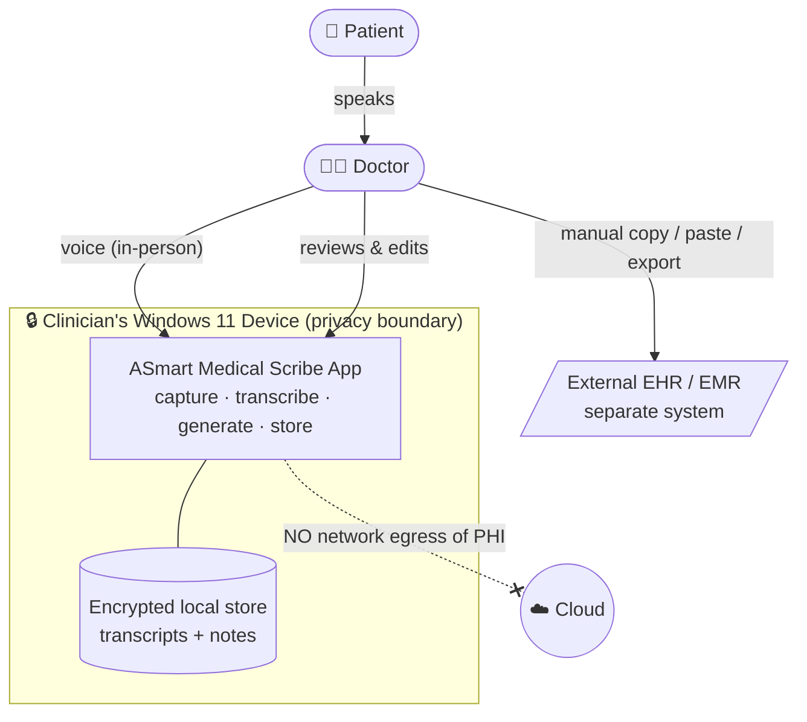
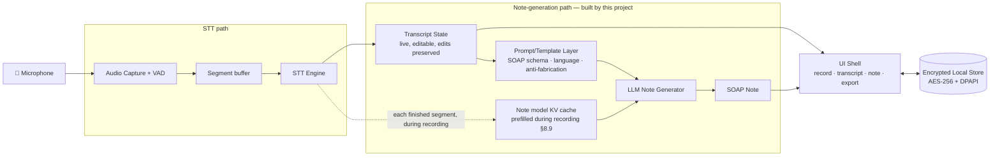
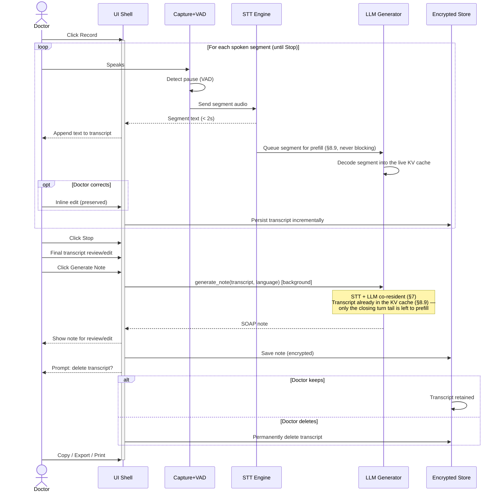
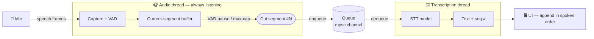

# ASmart Medical Scribe — System Design

> An on-device application that records doctor–patient conversations, transcribes them locally, and generates structured SOAP-R clinical notes — with no patient data ever leaving the clinician's Windows device.

## Table of Contents

1. [Overview](#1-overview)
2. [Functional Requirements](#2-functional-requirements)
3. [Non-Functional Requirements](#3-non-functional-requirements)
4. [Architecture & Model Selection](#4-architecture--model-selection)
5. [Diagrams](#5-diagrams)
6. [Speech-to-Text Pipeline](#6-speech-to-text-pipeline)
7. [Model Residency Strategy](#7-model-residency-strategy)
8. [Note Generation (LLM)](#8-note-generation-llm)
9. [Data Model & Interfaces](#9-data-model--interfaces)
10. [Security & Compliance](#10-security--compliance)
11. [Trade-offs & Alternatives](#11-trade-offs--alternatives)
12. [Pricing](#12-pricing)
13. [Future Considerations](#13-future-considerations)
14. [Distribution, Updates & Telemetry](#14-distribution-updates--telemetry)

---

## 1. Overview

### Problem statement

Clinicians lose significant time to documentation — writing up each encounter during or after the visit pulls attention away from the patient and extends the working day. Existing AI scribe products are cloud-based, which raises privacy/compliance concerns under Canadian law (PHIPA/PIPEDA) and locks small clinics into recurring per-seat subscriptions.

This product lets the doctor focus on **one thing — treating the patient** — while the application handles documentation. It is **cost-effective** (one-time payment) and **fully private**: all audio capture, transcription, and note generation run on the clinician's own device.

### Goals (in scope for v1)

- Capture doctor–patient conversation audio on the clinician's Windows device for **in-person** consults.
- Transcribe the conversation locally (speech-to-text).
- Generate a structured **SOAP-R clinical note** from the transcript, fully on-device.
- Keep the transcript locally so the doctor can revisit it; the doctor can delete transcripts at any time.
- Run entirely on commodity clinician hardware: **Windows 11, 16 GB RAM or higher**. CPU-only inference is the guaranteed baseline; where the machine has an integrated or discrete GPU, note generation uses it (§8.8).

### Non-goals (explicitly out of scope for v1)

- **No EMR/EHR integration** — the doctor copies the note manually into their chart.
- **No billing codes, ICD-10-CA codes, orders, or referrals** — deferred to a future phase.
- **No online/telehealth consults** — v1 captures in-person visits only.

### Key assumptions & constraints

- Target hardware: **Windows 11, 16 GB RAM or higher, CPU-only**. This is the binding constraint on model selection and on whether transcription is real-time vs. post-encounter. A GPU is **never assumed** — when one is present it accelerates note generation (§8.8), but nothing in the design depends on it.
- In-person capture uses a **single microphone** picking up both doctor and patient in the same room.
- **Human-in-the-loop:** the doctor reviews and edits every note; the tool never auto-files anything.
- **Audio is processed, not permanently retained**; the **transcript is retained locally** until the doctor deletes it.
- Market: **Canada** — PHIPA/PIPEDA govern handling of personal health information.

---

## 2. Functional Requirements

The system works like a dictation tool tuned for a clinical visit. While the doctor records, the app transcribes **incrementally**: each time the speaker pauses, the just-spoken segment is transcribed and appended to the on-screen transcript, which the doctor can correct inline at any time (they speak and edit at different moments, never simultaneously). The core loop: **record → see text appear segment-by-segment, → Stop → final transcript review → edit if needed -> click Generate → review/edit the notes → save**. Note generation is **explicit (on click)**, after the doctor is happy with the transcript. Capabilities are prioritized P0 (must-have for v1), P1 (should-have), P2 (deferred/future).

### Capabilities

| # | Capability | Priority | Actor | Trigger | Behavior | Success outcome |
|---|-----------|----------|-------|---------|----------|-----------------|
| FR-1 | **Start/stop recording** | P0 | Doctor | Clicks "Record" at visit start, "Stop" at end | Continuously captures microphone audio for the in-person encounter; shows elapsed time and a recording indicator | A live, growing transcript and a final transcript on Stop |
| FR-2 | **Incremental (segmented) transcription** | P0 | System | Doctor pauses speaking (silence/VAD-detected gap) | Transcribes the just-spoken segment locally and **appends it to the on-screen transcript immediately**, then continues listening for the next segment. | Doctor sees captured text appear segment-by-segment during the visit, with no perceptible wait |
| FR-3 | **Pause/resume recording** | P1 | Doctor | Clicks "Pause" mid-visit | Suspends capture (e.g. patient steps out, private moment) and resumes into the same transcript | Audio excludes paused segments; single continuous transcript |
| FR-4 | **Final transcript review & edit** | P0 | Doctor | After Stop, before generating | Doctor sees the full assembled transcript as a single paragraph and may do a final edit | A doctor-approved transcript ready for note generation |
| FR-5 | **Generate SOAP-R note (on click)** | P0 | Doctor / System | Doctor clicks "Generate Note" | Local LLM produces a structured note with Subjective / Objective / Assessment / Plan / Response sections from the (possibly edited) transcript | A clean, correctly-sectioned SOAP-R note |
| FR-6 | **Review & edit note** | P0 | Doctor | Note displayed | Doctor reads and freely edits any section before use (human-in-the-loop; nothing is auto-filed). May go back, edit the transcript, and regenerate if the note is badly wrong | Doctor-approved note text |
| FR-7 | **Mic device selection & level check** | P1 | Doctor | Before/at recording | Choose input device and see a live input-level meter to confirm audio is being captured | Confidence that the right mic is working before the visit |
| FR-8 | **Browse & reopen saved encounters** | P1 | Doctor | Opens the saved-encounters list | Lists previously saved encounters (timestamp/label) and lets the doctor reopen a transcript/note to view, edit, re-export, or delete | Doctor can return to past notes without an external system |

### Session & retention model

- **Transcripts and notes are persisted locally inside the application** and remain available across sessions until the doctor deletes them. The app keeps a local store of past encounters the doctor can revisit.
- **Audio is transient**: held only long enough to transcribe each segment, then discarded. Audio is never written to disk as a retained file.
- All persisted PHI (transcripts and notes) is **encrypted at rest** (see NFRs) so a lost or stolen device does not expose patient data.

### Edge cases

- **Silence / no speech**: produce an empty or "insufficient audio" result rather than a hallucinated note.
---

## 3. Non-Functional Requirements

All targets are for the **binding hardware profile**: Windows 11, 16 GB RAM or higher, **CPU-only, no GPU**. Numbers are design targets to validate during benchmarking, not guarantees, given on-device model variability. GPU acceleration (§8.8) is **upside, not a new floor** — every target below must hold on a machine with no usable GPU.

| # | Requirement | Target | Rationale |
|---|------------|--------|-----------|
| NFR-1 | **Per-segment transcription latency** | Captured text appears **< 2 s** after a speech pause (for a typical 5–15 s utterance) | Must feel near-instant so the doctor isn't waiting mid-visit; drives choice of a fast, CPU-light STT model (Parakeet TDT v3, §6.4) |
| NFR-2 | **Note generation** | Runs in a **background queue**; doctor is not blocked and can start the next patient. Target completion **< 90 s** for a ~20-min encounter on the 16 GB profile | A 7–8B quantized LLM on CPU needs time; backgrounding hides it so throughput isn't affected |
| NFR-3 | **Encounter length** | Handle encounters up to **~30 min** of audio without instability | Headroom over the ~20-min average; long visits must not exhaust memory |
| NFR-4 | **Peak memory** | Total app + models peak **< 12 GB RAM** | Leaves ~4 GB for Windows + the doctor's EHR/browser on a 16 GB machine; STT + LLM stay co-resident (§7) |
| NFR-5 | **Encryption at rest** | All persisted PHI (transcripts, notes, app store) **encrypted at rest** (AES-256; key protected via Windows DPAPI tied to the user account) | Persistent local PHI must survive device loss/theft without exposure |
| NFR-6 | **Durability / crash safety** | Captured transcript persisted incrementally so an app/OS crash mid-visit loses **≤ the last unsaved segment** | A 20-min visit's transcript must not vanish on a crash |
| NFR-7 | **Data lifecycle** | Audio discarded immediately after each segment is transcribed; transcript/note retained until the doctor deletes them; deletions are **permanent** (no recycle/cloud copy) | Minimizes audio PHI footprint; gives the doctor full control over retained text |
| NFR-8 | **Note quality** | No hard WER SLA in v1. Commit: **all SOAP-R sections populated only from transcript facts, no fabricated content**; **mandatory human review** before use | Honest given CPU-model limits; safety comes from the human-in-the-loop, not model perfection |
| NFR-9 | **Availability** | N/A as a service (local desktop app); target **no crash** across a full clinic day; graceful recovery on restart | It's a local app |
| NFR-10 | **Install & footprint** | Single Windows installer; models downloaded once after installation; on-disk footprint **target < 10-20 GB** (STT + LLM weights) | Must be deployable by a non-technical clinic on a normal laptop |
| NFR-11 | **Cold start** | App ready to record **< 10 s** from launch (models may lazy-load on first record) | Doctor can't wait minutes between patients |

---

## 4. Architecture & Model Selection

### Component overview


| Component | Responsibility | 
|-----------|----------------|
| **Audio capture** | Read microphone, buffer PCM, detect speech pauses (VAD) to segment utterances
| **STT engine** | Transcribe each audio segment to text; EN/FR auto-detect
| **Transcript store** | Hold the live, editable transcript; persist per-encounter; preserve manual edits
| **Note generator (LLM)** | Turn the approved transcript into a structured SOAP note (EN/FR), on click
| **Prompt/template layer** | SOAP-R system prompt, section schema, language handling, anti-fabrication guardrails
| **Local store** | Encrypted persistence of transcripts + notes; saved-encounter list
| **UI shell** | Record controls, live transcript, note view/edit, export/print, saved list

### Model selection — note generator (the focus of v1)

- **Runtime:** `llama.cpp` (GGUF), CPU inference, 4-bit quantization to fit memory and hit latency.
- **Single model (v0.1.2):** **`gemma-4-E2B-it-UD-Q4_K_XL`** — one note-generation model for every device. The multi-tier scheme (Mistral-7B / Phi-3.5 Q8 / Phi-3.5 Q4, chosen by RAM) is **retired**: a single small, capable model removes the RAM-keyed branching, the doctor-facing model picker, and the on-demand tier downloads. On upgrade the app deletes the old tier weights (§8.2).
- **Swappable interface:** the note generator still sits behind an internal `generate_note(transcript) -> SOAP-R` interface so the model can be upgraded without touching the rest of the app (NFR-14). What changed in v0.1.2 is that there is exactly **one** model behind that interface, not a user-selectable set.

---

## 5. Diagrams

### 5.1 System context

Shows who uses the app and the hard boundary of the clinician's device. The only external system is the EHR, reached **manually** via clipboard/file by the doctor — the app never talks to it.



### 5.2 Component diagram

The internal building blocks (Section 4). The STT path is the existing OSS component; the note-generation path is what this project primarily builds.



### 5.3 Sequence — live capture → note generation

The core runtime flow: incremental transcription during the visit, then on-click note generation, then the delete-transcript prompt.



---

## 6. Speech-to-Text Pipeline

This section details the on-device speech-to-text (STT) subsystem — the path from raw microphone input to editable transcript text. It is implemented in the **Rust backend** of the Tauri application and runs entirely locally. The pipeline is described as a sequence of discrete stages.

### 6.1 Audio capture

The capture stage turns live microphone input into a clean, uniform audio signal that the rest of the pipeline can rely on. It records **all** incoming sound — deciding what is speech versus silence is a later stage (VAD, §6.2), not capture's job.

**Design:**

- **Dedicated capture thread.** Audio capture runs on its own thread inside the app process (not a separate process), parallel to the UI. Its single job is to pull audio frames from the microphone as they arrive and forward them downstream over a thread-safe channel (mpsc). Isolating capture on its own thread guarantees that UI work (rendering, button clicks) can never stall capture and cause dropped audio. The thread is active for the duration of a recording and parked when idle.
- **Cross-platform audio I/O via `cpal`.** The app opens the OS default or a user-selected input device and reads its **native format** — whatever sample type (e.g. `u8`, `i16`, `f32`), sample rate, and channel count the hardware happens to provide.
- **Normalize to a uniform signal.** Every captured sample is converted to **32-bit float (`f32`)**, and the stream is **resampled to 16 kHz mono** (via `rubato`).
  - *`f32`* — one uniform numeric format downstream, normalized to the −1.0…+1.0 range, avoiding precision loss in subsequent math.
  - *16 kHz* — human speech information lives below ~8 kHz; by the Nyquist limit, 16 kHz sampling captures all of it. Higher rates (44.1/48 kHz) only add data the model doesn't need, increasing compute for no accuracy gain. 16 kHz is the minimum rate that fully preserves speech.
  - *mono* — a single combined channel; stereo is redundant for transcribing speech and doubles the data.

  Normalization changes only the *format/resolution* of the audio, never its content — all sounds (voices, noise, silence) are still present, just represented efficiently.
- **Live input-level feedback.** A lightweight tap on the capture stream computes the current input amplitude and pushes it to the UI to drive a live waveform / volume meter. This is purely UX — it lets the clinician confirm the microphone is live and picking up sound **before** committing a full visit to recording (supports FR-12).

### 6.2 Voice activity detection (VAD)

The VAD stage consumes the clean 16 kHz stream from §6.1 and classifies it, frame by frame, as **speech** or **silence/noise**. Its output serves two purposes: it **drops non-speech audio before the model sees it** (improving accuracy and speed), and it **defines segment boundaries** — where one spoken utterance ends and the next begins — which drives the transcription trigger (§6.3).

**Design:**

- **Neural VAD (Silero).** A small, CPU-cheap neural model classifies audio by the acoustic signature of human speech, rather than by raw loudness. This is deliberately chosen over a simple energy/volume threshold: an exam room has door slams, keyboard noise, and HVAC hum that a loudness threshold would misfire on, while quiet talking would be missed. Silero ignores loud non-speech and still catches soft speech, making it robust to real clinical background noise.
- **Frame-by-frame probability.** Audio is fed in **30 ms frames**; for each, Silero emits a speech **probability** (0.0–1.0). A configurable **threshold** (default ~0.5) converts this to a speech/noise decision, so noisy rooms can be tuned without code changes.
- **Smoothing layer.** Raw per-frame decisions are too jittery to define segments directly, so the VAD is wrapped in a smoothing layer with three controls:
  - **Onset** — requires N *consecutive* speech frames before declaring speech has started, so brief blips (a cough, a clink) don't open a spurious segment.
  - **Hangover** — after speech appears to stop, keeps the segment open for N more frames; only a *sustained* silence ends it. This prevents a natural mid-sentence pause from prematurely chopping a segment.
  - **Prefill (pre-roll)** — buffers the few frames immediately *before* onset fired and prepends them to the segment, so the leading syllable of the first word isn't clipped.
- **Clinical tuning bias.** Defaults lean toward a **longer hangover**: clinicians and patients pause mid-thought, and the system should prefer keeping an utterance whole over fragmenting it. Exact onset/hangover/prefill/threshold values are set during benchmarking against real clinical audio.

> Note: the hangover/sustained-silence duration that closes a segment is the same signal that defines a **segment boundary**, which is the transcription trigger detailed in §6.3.

### 6.3 Segment buffering & transcription trigger

This stage answers: **when is audio handed to the STT model, and how often?** The answer defines the live, incremental transcription experience (FR-2). All of this runs inside the single app process, across parallel threads.

**Why not transcribe once at the end.** The simplest approach — accumulate the whole recording and transcribe once on Stop — is unacceptable for a ~20-minute encounter: the doctor would see nothing until Stop, then wait through one large transcription, with the entire visit's audio held in memory. Instead, the system transcribes **one segment at a time**, cutting at the natural pauses that VAD (§6.2) already detects, so the transcript grows line-by-line during the visit.

**Design:**

- **Accumulate the current segment.** Speech frames passed by VAD append to a current-segment buffer; silence/noise frames are dropped.
- **Close & flush on a pause boundary.** When VAD reports sustained silence (hangover expires), the current segment is complete: its audio is flushed as one finished segment, the buffer is cleared, and accumulation resumes for the next segment.
- **Decoupled threads via a queue.** The capture (audio) thread never runs the model. A finished segment is pushed onto a thread-safe queue (mpsc channel); the capture thread immediately resumes listening. A separate **transcription worker thread** pulls segments from the queue and runs STT (model kept warm — §6.4). This decoupling guarantees that a slow transcription can never stall capture or drop audio (NFR-1).

- Mental model: 
    - audio thread = ears (always listening)
    - transcription thread = hands (typing it out)
    - queue = conveyor belt between them.

- **Ordered assembly.** Because transcription is asynchronous, each segment carries a **sequence number** so the UI appends results in spoken order (FR-2/FR-3), regardless of completion timing.
- **Tail flush on Stop.** On Stop, any still-open segment is force-flushed so the final words are transcribed and not lost.

**Safeguards:**

| Safeguard | Problem it solves | Design |
|-----------|-------------------|--------|
| **Max-segment cap** | A speaker who talks continuously with no real pause never triggers a boundary, producing one oversized segment that breaks latency and grows memory | Force-flush the current segment after a maximum duration (≈20–30 s) even without a pause boundary, bounding latency (NFR-1) and memory (NFR-5) |
| **Min-segment floor** | Tiny blips create useless sub-second fragments | VAD onset filters most; additionally discard segments below a minimum length |

**Trade-off accepted:** transcribing per-segment gives live feedback but means the model sees one utterance at a time and loses cross-segment conversational context. For the Parakeet model this is a minor accuracy cost, accepted in exchange for the live incremental UX that FR-2 requires.



### 6.4 STT engine & model lifecycle

This stage answers: **which model runs, and when does it live in RAM?** The lifecycle is where the system honors the memory budget (NFR-5, <12 GB peak) without paying a model-load cost on every segment.

**The engine.** Transcription runs through a Rust STT engine that executes the Parakeet model locally on CPU via an ONNX runtime. It sits behind a narrow, swappable interface (`transcribe(audio) -> text`), so the underlying model can be changed without touching the capture, VAD, or assembly stages (NFR-14).

**Model** (see §4 for selection rationale):

| Role | Model | License | Notes |
|------|-------|---------|-------|
| Sole engine (v1) | Parakeet TDT 0.6B v3 | CC-BY-4.0 (attribution required) | Fast, CPU-light, multilingual EN+FR with auto-detect; the all-rounder default. v1 ships this as the only STT engine |

Models are downloaded once on first selection and cached on disk thereafter.

**Lifecycle — "warm during use, released when idle":**

- **Warm for the whole encounter.** Once loaded, the model stays resident in RAM across *every* segment of the visit. The per-segment cost is therefore inference only — no repeated loading — which is the single biggest contributor to keeping segment latency low (NFR-1).
- **Background preload on app open.** The app window paints instantly (cold start <10 s, NFR-13); immediately after, a background thread begins loading the model so it is warm by the time the clinician presses Record. The UI is never blocked on the load. Recording is the app's primary purpose, so preloading — rather than waiting for the first Record — hides the one-time disk read (≈1–3 s to read the model file off SSD into RAM) behind the app-open moment.
- **Idle-unload via a watcher thread.** A background watcher periodically checks the time since the model was last used; past a configurable idle timeout it unloads the model and frees the RAM, returning memory to the clinician's other applications between patients. The watcher never unloads a model that is mid-recording.
- **Reloads are cheap.** After a model has been loaded once, the OS keeps its file pages in the disk cache, so a reload shortly after (e.g. the next patient) is near-instant — it reads from RAM-cached pages rather than the SSD. Only sustained idleness incurs a full disk read again.
- **Safe concurrency.** The resident model is guarded so a Record action and an idle-unload cannot collide; loading is coordinated so two triggers can't load it twice.

### 6.5 Transcript assembly & delivery to UI

This stage answers: **how does a finished segment reach the screen — live, in order, without clobbering edits the clinician has already made?** (FR-2 live transcription, FR-3 editable transcript.)

**Push, not pull.** The transcription worker produces, per segment, `{ sequence_number, text }`. It crosses the Rust↔webview boundary by **emitting an event**; the frontend **listens** and appends. The backend never renders the transcript and does not hold a master copy that the UI mirrors — it only announces finished segments.

```
Worker thread (Rust) ── emit("transcript-segment", {seq, text}) ──► React listener ──► append to editor
```

**Asynchronous and non-blocking.** Neither side waits on the other: Rust emits and immediately returns to its work; the React listener reacts whenever an event arrives. This is what keeps capture and transcription from ever stalling on the UI (NFR-1).

**Ordered append.** Because segments finish asynchronously (a short utterance can transcribe before an earlier long one), each carries the **sequence number** assigned in §6.3. The UI maintains an ordered-by-sequence list and places each segment at its correct position, so the displayed order always matches the spoken order regardless of completion timing. Each segment is delivered **once, already final** — there is no mid-segment partial/streaming text, which avoids flicker at the cost of one-utterance (rather than word-by-word) granularity.

**Edit preservation (FR-3) — append-only backend, frontend owns the document.** The clinician can edit the transcript while recording continues (correcting a drug name, a dosage). The rule that protects those edits:
- New segments are **only ever appended at the tail**; the backend never rewrites or re-inserts into already-delivered text.
- Once a segment is in the editor, it belongs to the **frontend's editable document**, which is the source of truth — the backend has no channel to mutate prior lines.
- Consequently an edit to an earlier segment is untouched when a later segment arrives; they are disjoint regions and the backend writes only to the growing tail.
- The full transcript is therefore **never re-sent** (which would wipe edits) — only incremental appends are emitted.

**Backend copy is backup only.** The backend may retain a raw transcript copy purely for crash-recovery / autosave, but that is a backup — not the artifact the UI mirrors. The editable truth lives in the frontend.

**Two destinations, in order.** The sink that receives a finished segment has a second consumer: after emitting to the UI, it queues the same text for the note model's KV cache (**§8.9**). The order is fixed — UI first, prefill second — and the prefill hop is a queue push that never blocks, so a slow or stopped prefill can never delay the transcript reaching the screen. The prefill copy is not a second source of truth: it is discarded at the next Start, and Generate still works from the frontend's document.

### 6.6 Threading & coordination (orchestration)

This stage answers: **what ties Pieces 6.1–6.5 together into a single, well-behaved lifecycle?** It adds no new audio or STT component — it is the **coordinator** that owns application state and spins the recording's threads up and down cleanly so nothing leaks and nothing is lost.

**The state machine.** A recording encounter moves through three states, owned by the backend:

```
        Start                Stop
 IDLE ─────────► RECORDING ─────────► PROCESSING ─────► IDLE
  ▲   (spin up)             (drain & finalize)            │
  └───────────────────────────────────────────────────────┘
```

- **IDLE** — app open, the STT model preloaded/warm in the background (§6.4), no capture running.
- **RECORDING** — the capture thread and transcription worker are both live and running asynchronously in parallel; segments flow through the queue and finished text is emitted to the UI (§6.3, §6.5).
- **PROCESSING** — Stop has been pressed: capture has ended, but in-flight audio is still being finalized. Brief in v1; this is also the lifecycle slot where phase-two note generation will run.

**The threads.**

- **Capture thread** (the "ears") — owns the cpal stream and VAD; emits audio *segments* into the queue.
- **Transcription worker** (the "hands") — pulls segments off the queue, runs the STT engine, and emits finished text to the UI.
- **Prefill thread** (**§8.9**) — holds the note model and one live context for the recording, and decodes each finished segment into its KV cache. Started at Start, before the first segment can land; dropped at the next Start, when an old record is opened, or on unload. Because it holds the model lock for the whole recording, everything that needs the model during a recording goes through it.
- **UI thread** — renders the editable transcript and owns the Start/Stop controls.

The two hops differ by design: **capture → transcription is an mpsc queue** (a real buffer that can hold a backlog), while **transcription → UI is a push event** (§6.5), not a buffer the UI drains.

**Who owns Start/Stop.** The UI *requests* transitions across the bridge (`invoke("start_recording")` / `invoke("stop_recording")`, triggered by a button or hotkey). The **backend coordinator owns the actual state** and decides whether a transition is legal. **State guards** reject illegal or duplicate transitions (a second Start while already RECORDING, or a Start during PROCESSING) so rapid clicks or hotkey spam can't corrupt the machine.

**Start — spin up.** On `IDLE → RECORDING`: ensure the model is loaded (normally already warm from preload; otherwise load with a brief "loading…" state), open the mpsc queue and wake the transcription worker, then start the capture thread. Capture and transcription now run in parallel; the coordinator returns immediately and does **not** block for the duration of the recording.

**Stop — drain & finalize.** On `RECORDING → PROCESSING`, order matters so no audio is lost:

1. Signal the capture thread to stop and **tail-flush** the open segment (§6.3) into the queue.
2. Let the worker **drain the queue** — transcribe every remaining segment and emit it.
3. Once the last segment has been emitted to the UI, transition to **IDLE**.

The model is **not** unloaded here in v1 — it is left warm, and the idle-watcher (§6.4) releases it later if the app sits unused. *(Phase two: PROCESSING is where the co-resident LLM (§7) generates the note; both models stay warm.)*

**Clean teardown & resilience.** Threads are stopped via a signal and **joined** (or parked for reuse) and the queue is closed, so no orphaned threads survive between encounters. If a thread **panics** (e.g. a model error), the coordinator catches it, surfaces an error to the UI, and returns the machine to a safe **IDLE** rather than wedging.

---

## 7. Model Residency Strategy

The application runs two models on the same machine: the speech-to-text model used during recording, and the note-generation (LLM) model used after recording stops. Both are sizable and resident while in use. STT is always on the CPU (ONNX); the LLM runs on a GPU when one is available (§8.8).

**Co-residency, always.** With a single small note model (§8.2), both models stay warm in RAM **at the same time** for the life of the session — no swapping, no per-device mode decision. The single ~3.2 GB Gemma model alongside the STT model fits comfortably on the target hardware, so the hand-off from transcription to note generation is instantaneous.

This assumes a **16 GB (or higher) machine** — the binding hardware profile (§2). Co-residency keeps a real buffer for the app, webview, OS, and the clinician's other applications on such a device; smaller machines are out of scope for now.

**Where the LLM's ~3.2 GB actually sits** depends on the backend chosen at load (§8.8), and only the discrete case changes the budget:

| Backend | LLM weights + KV live in | Effect on the §7 system-RAM budget |
|---------|--------------------------|-------------------------------------|
| Discrete GPU | VRAM | **Frees ~3.2 GB of system RAM** — the budget gets easier |
| Integrated GPU | System RAM (shared with the CPU) | **Unchanged** — the iGPU allocates from the same pool |
| CPU | System RAM | Unchanged — the baseline this section was written against |

The budget above is therefore stated for the worst case (CPU or iGPU). A discrete GPU only ever adds headroom, so no separate accounting is needed.

**One extra context during a session.** Transcript prefill (§8.9) keeps a single `n_ctx` context alive from Start until the session ends, on top of the weights. It is one context, not one per segment — the same context is reused for every segment and then for the note — and it sits wherever the weights sit (VRAM on a discrete GPU, system RAM otherwise). Generate no longer builds a second context on the prefilled path, so this replaces the per-note context rather than adding to it; the fallback path (§8.6) still builds its own.

---

## 8. Note Generation (LLM)

Phase two turns a verified transcript into a structured clinical note. This section is built up piece by piece.

### 8.1 Trigger & input

Note generation is **manual and explicit**, not automatic on Stop. The sequence is:

1. **Stop** finalizes the transcript. In-flight audio is flushed and the last segments land in the transcript (the Processing→Idle drain described in §6.6). The complete transcript is shown in the UI and the machine is back at rest — no model is running.
2. **The clinician reviews and edits the transcript.**
3. **The clinician clicks Generate.** *This* is the trigger that starts note generation, operating on the transcript exactly as the user left it.

Making generation an explicit, post-review action is a deliberate clinical-safety choice: the clinician verifies the source text before a note is built from it, and the expensive LLM step is decoupled from recording.

**Input.** Generation receives the **plain transcript text, as edited** — a flat text stream. It carries:

- **No speaker labels.** The speech-to-text models transcribe words only; they do not identify speakers. Speaker attribution ("who spoke when") is a separate task (diarization) requiring an additional, error-prone model that would compete for the memory budget in §7. For a two-party encounter the note-generation model infers role from content well enough, so v1 sends flat text and defers diarization to Future Considerations.
- **No extra metadata.** No visit type, specialty, or patient identifiers are sent to the model. The clinically relevant content is already in the transcript; the encounter date is stamped by the app at save time, not by the model.

**Regeneration & versioning.** Each press of **Generate** produces a **new note version** tied to the encounter; previous versions are **retained and revertable**. A clinician who prefers an earlier generation can fall back to it. (The storage mechanics live in Piece 6 — Delivery & persistence.)

**Editing.** The generated note is **editable directly in the application.** The clinician revises the model's output in place, and the edited text is what gets saved as the final note. Combined with versioning, the user may also revert to an earlier generated version and edit that one instead.

**Guard.** Generate is **disabled when the transcript is empty** and is **only available in the Idle state** — never mid-recording.

### 8.2 Model & runtime

**Model selection (v0.1.2 — single model).** There is **one** note-generation model, `gemma-4-E2B-it-UD-Q4_K_XL`, used on every device. Prior versions picked one of three tiers by total RAM and let the doctor override it; that whole scheme is retired. The model is small and capable enough that a fit-to-machine choice is no longer worth its complexity, so:

- there is **no `model_choice` setting** and **no model picker** in Settings (§9.3);
- there are **no on-demand tier downloads** — Setup fetches exactly one LLM;
- both models are **co-resident** on the 16 GB+ target hardware (§7) — no RAM probe, no per-model footprint estimate.

| Model | Quant | On-disk size |
|-------|-------|--------------|
| `gemma-4-E2B-it-UD-Q4_K_XL` | Q4_K_XL (Unsloth dynamic) | 3.18 GB |

**Execution model.** The GGUF model runs **in-process** inside the Rust backend via the `llama-cpp-2` binding to llama.cpp — no separate inference server, no external process, and no network calls. This keeps all note generation fully on-device, satisfying the zero-egress requirement (NFR-6). The compute backend — discrete GPU, integrated GPU, or CPU — is chosen automatically at load time; see **§8.8**.

**Model distribution & first-run setup.** The installer ships **no** model weights — it carries only the application (and the small VAD model), keeping the download lean. The models the app needs are fetched **once, on first launch**, through a one-time **Setup** step, then cached on disk and reused every launch — fully offline thereafter (matching the STT lifecycle in §6.4). Setup now downloads exactly two files: the **single Gemma note model** and the **Parakeet STT model**. There is no longer any "download another tier later" affordance.

- **Gated until ready.** On launch the app checks whether the required models are present; if not, it shows the Setup screen and does not proceed into recording/generation until both are downloaded and verified. Once present, Setup is skipped entirely.
- **Integrity-checked.** Each download is verified against a known SHA-256 checksum before it is accepted, so a corrupted or truncated transfer is rejected rather than loaded.
- **Not PHI egress.** These are model-weight downloads on first run, the only outbound network calls in the app; no patient data ever crosses the device boundary (NFR-6). After Setup the app runs with no network dependency for core function.
- **Detects the compute backend, then primes the prefix KV, before handing over.** Once both downloads verify, Setup performs two further steps in-app. First it settles the §8.8 backend question — discrete GPU, integrated GPU, or CPU — in a short-lived child process, and caches the answer; this must come *before* the load, since it decides where the model is loaded. Then it loads the models, prefills the fixed prompt prefix, and writes the KV blob(s) to disk (§8.7) — two of them on a GPU machine, CPU first. It is shown as its own "Preparing note model…" step because it takes ~22s, and the models are **left loaded** afterwards so the clinician's first session starts immediately. Every later launch reads the blob instead (~0.01s). Mechanically this is the ordinary co-resident preload (§8.2 startup fix), re-run: the preload gate fires once at window mount, which on a first run is *before* the weights exist, so that attempt fails and **re-arms** the gate; Setup triggers it again once both downloads verify, and waits on the same `llm-status` event the main screen uses.

**Upgrade migration — delete the retired tier weights.** A device upgrading from a prior version still has the old GGUFs (`mistral.gguf`, `phi-q8.gguf`, `phi-q4.gguf`) in its app-data models dir — several GB that will never be loaded again. On first launch of v0.1.2 the app **deletes any of these that exist** from the writable models dir (the bundled resource dir is read-only and carries none), reclaiming the disk. The deletion is best-effort and idempotent: a missing file is a no-op, a failed unlink is logged and does not block startup.

**Startup model load is non-blocking (v0.1.2 "not responding" fix).** In co-resident mode the model was previously loaded **synchronously inside the Tauri `setup` hook**, which runs on the main thread before the webview can paint — so a multi-GB GGUF load plus warmup left the window unresponsive ("not responding") for the whole load on every launch. In v0.1.2 the app **finishes starting first**: `setup` returns immediately and the window paints, and the co-resident preload (model load + prefix warmup, §8.6) runs on a **background thread**. The UI reflects load state via an `llm-status` event (`loading` → `ready`, or `error`; §9.5) so a status indicator can read "Preparing note model…" while it loads and enable Generate when ready. A concurrent-load guard serializes the background preload against a Generate that arrives before it finishes, so the model is loaded at most once.

**Tuning notes:**

- **Thread count — the two phases are split.** At startup the app reads the machine's **physical** core count **once** and derives every thread count from it: decode (`n_threads`) gets `physical / 2` (floor, minimum 1) and prefill (`n_threads_batch`) gets the remainder, `physical − physical / 2` (minimum 1). Rationale: token-by-token decode is memory-bandwidth-bound and stops scaling — often regresses — past a fraction of the cores, while prefill is compute-bound and still benefits from the full set, so the two phases are tuned independently. The remainder is the larger side on an odd core count, deliberately: prefill is batched and scales, decode does not. STT takes the same `physical / 2` share (§6.4), so prefill runs on the cores STT left over — which is what makes prefilling *during* a recording (§8.9) affordable. If the core count is unavailable, llama.cpp picks both counts itself and everything still works.
- **Context window.** `n_ctx = 8192` — covers the fixed prompt prefix (system + few-shot examples, §8.3) plus the longest realistic transcript plus the generated note, while staying well under the model maximum and not reserving RAM the §7 budget needs.
- **Max output tokens.** `max_output_tokens = 1536` — the ceiling for one generation. Note (§8.3): with chain-of-thought this budget must cover the model's reasoning **and** the note; the few-shot examples model brief reasoning to keep the note within budget (validate in benchmarking).
- **Sampling** — low temperature for near-deterministic, low-hallucination clinical output (finalized alongside the prompt in §8.3).
- **Prompt caching (fixed prefix reuse).** The system prompt + few-shot examples (§8.3) are byte-identical every generation; ordering them ahead of the transcript lets their KV cache be prefilled once and reused across notes instead of re-read each time. Full design in **§8.6**.

### 8.3 Prompt & output structure

**Output format — markdown.** The model emits the note as **markdown** with five fixed section headers (`## Subjective`, `## Objective`, `## Assessment`, `## Plan`, `## Response`) — the SOAP-R structure. Markdown is the single representation used everywhere:

- **Display** — rendered as a formatted document in the UI (like a markdown preview), so the clinician sees an ordinary-looking note rather than raw `##`/`**` markers.
- **Edit** — the clinician edits in-app (§8.1); the note stays markdown throughout.
- **Store & version** — markdown is plain text, so persistence and versioning (§8.5) are trivial.

**Input — whole transcript, single prompt.** The full transcript is passed in one prompt with no context-handling layer (no chunking or pipeline); structured SOAP output comes from prompt engineering alone, since the window far exceeds a realistic consult.

**Scope — five sections (SOAP-R).** v1 produces **Subjective / Objective / Assessment / Plan / Response**.
- Subjective(S) — patient's reported symptoms, feelings, history
- Objective(O) — measurable/observed data (vitals, exam, results)
- Assessment(A) — clinician's diagnosis/interpretation of S+O
- Plan(P) — next steps (treatment, meds, referrals, follow-up)
- Response(R) — how the patient responded to prior treatment since last visit

**Bulleted, concise output.** Sections are written as **concise bullet points, not paragraphs**.

**Empty sections.** A section the transcript has no material for is written as **"Not discussed"**.

**Prompting approach — few-shot + chain-of-thought (v0.1.2).** The prompt carries **several worked examples** (raw, messy consult transcripts paired with their ideal bulleted SOAP-R notes) and instructs the model to **reason before writing** — briefly work through what belongs in each section, then emit the note. Few-shot locks structure and style more reliably than a single example, and the chain-of-thought step improves per-section placement and the anti-fabrication discipline (§8.3 safety rules) on messy transcripts. The exact system prompt and examples are a **fixed, supplied artifact** (provided at implementation) — this section fixes the *contract* around it, not its wording.

- **Reasoning is never part of the note.** The model's chain-of-thought is an intermediate, not clinical output: it must not be persisted, and it must not be shown as if it were the note. The prompt separates reasoning from the note with a **fixed boundary** the generator keys on — either an explicit delimiter emitted by the model or the first SOAP header (`## Subjective`). The generator suppresses streaming until that boundary is reached, then streams and persists **only** the note portion (§8.5). *(The precise boundary token follows from the supplied prompt and is pinned in implementation so the parser and the prompt agree exactly.)*
- **Output-budget interaction.** Reasoning tokens are decoded under the same `max_output_tokens = 1536` ceiling as the note (§8.2). The examples deliberately model **concise** reasoning so the note is not truncated; this is a benchmarking check, not a free lunch.
- **Fixed prefix, prompt-cached.** The system prompt + all few-shot examples are a **fixed prefix** (identical every note), prompt-cached (§8.6) so the added length costs negligible per-note latency — it is prefilled once and its KV state reused. Only the real transcript at the tail varies.

### 8.4 Lifecycle & orchestration

This section covers how a generation runs end to end: where it sits in the app's state machine, when the model is loaded, and how warmup, cancellation, and failure are handled.

**State machine.** Generation is a manual action from IDLE (the transcript is already finalized and editable, §8.1), so it is a distinct state rather than part of STT processing:

```
IDLE ──Generate──► GENERATING ──complete / cancel / fail──► IDLE
```

While in GENERATING, recording is blocked and a second Generate is ignored — a single generation is in flight at a time. On any exit (success, cancel, or failure) the app returns to IDLE with the transcript preserved intact.

**Model load timing — co-resident (§7).** The LLM is loaded **shortly after startup, on a background thread** (not blocking the UI) and stays resident. On Generate it is already in RAM (or the UI waited on the `ready` status), so generation starts immediately; it stays resident afterward for the next note. The one-time load cost is paid just after startup rather than inside it.

**Startup load runs off the UI thread (v0.1.2).** The co-resident preload must not run inside the Tauri `setup` hook — that blocks the main thread and leaves the window "not responding" for the whole multi-GB load (§8.2). Instead `setup` returns immediately, the window paints, and the preload runs on a background thread that emits `llm-status` (`loading` → `ready` / `error`, §9.5). A concurrent-load guard makes a Generate arriving mid-preload wait on the same load rather than starting a second one.

**Warmup.** The first inference after a model load is slower (cold weights, cold buffers). To keep the clinician's first real generation at full speed, a warmup pass runs immediately after the load — the same background-thread step that primes the prompt-prefix KV cache (§8.6).

**Cancellation.** A Cancel control stops generation mid-stream (via the decode loop's stop hook). On cancel, the partial note is **discarded** and the screen returns to its pre-Generate state; the transcript is untouched. Streamed output (below) keeps this responsive — the user sees tokens appear, so a cancel feels immediate.

**Streaming.** Tokens are streamed to the UI as they are produced rather than shown only when complete. This makes the wait *feel* short and makes cancellation feel instant. 

**Load-time RAM guard.** Even on a 16 GB+ machine, actual *available* RAM at load time can be low if the clinician has much else open. Before loading the LLM, available RAM is checked. If it is insufficient, the load fails gracefully: the app surfaces the error, stays in IDLE, and preserves the transcript — never a silent out-of-memory crash.

### 8.5 Delivery & persistence

This section covers how the streamed note reaches the screen and how it is stored durably and encrypted at rest.

**Streaming render.** The backend emits generated tokens as events to the frontend (§8.4); the frontend appends them to a buffer as they arrive. During the stream the buffer is shown as **raw text**; once generation completes, the final markdown is **rendered once** as the formatted document (§8.3). Live-rendering half-formed markdown — a `##` header with no body yet, an unclosed `**` — flickers and looks broken, so rendering is deferred to completion while the raw stream still gives the clinician immediate feedback.

**Reasoning is withheld from the stream (v0.1.2).** With chain-of-thought (§8.3) the model emits reasoning before the note. The generator does not forward those tokens: it withholds streaming until the reasoning→note boundary, then streams only the note. So both the streamed buffer and the persisted note contain the note alone — the clinician never sees the chain-of-thought, and it is never written to the encrypted store.

**Control tokens end the turn at the source (v0.1.2).** Some Gemma GGUFs don't include `<end_of_turn>` in their end-of-generation set, so `is_eog_token` misses it; rendered with special tokens enabled it would otherwise leak into the note *and* let decoding run on to the full token budget (wasted CPU). Each chat-template turn token (`<end_of_turn>`, `<start_of_turn>`) is a single token → a single complete decoded piece, so the decode loop ends the turn on an exact string match — no hold-back buffer needed — before the piece is streamed or appended.

**Deterministic marker scrub on the persisted note (v0.1.2).** The decode loop stops the turn at `<end_of_turn>` and the boundary suppression strips reasoning up to the *first* `</think>`; but a small quantized model sometimes echoes the structural tags again after the note body (typically a stray trailing `</think>`), which then flow through as note text. Before the note is persisted, a plain non-AI check-and-remove pass (`prompt::sanitize_note`) truncates at any residual turn marker and deletes any `<think>…</think>` span or orphan tag. It runs **once** on the finished note, so it adds no per-token latency, and it guarantees the saved clinical record is clean. *Future consideration:* the same deterministic scrub could be applied to the **live stream** so a stray marker never briefly flashes in the streaming view before generation completes — this needs a small hold-back tail buffer (a multi-token marker can split across two token pieces, the same reason the boundary search buffers), so it is deferred as cosmetic polish; the persisted note is already clean without it.

**Storage engine.** All clinical data is held in a single **SQLite database encrypted with SQLCipher**, so the note, its versions, and the transcript are encrypted at rest and never leave the device. Application settings remain in the separate plain JSON store (no PHI), as decided for Phase 1.

**Audio retention.** The audio recording is **discarded** once the transcript is finalized — it is never written to the database. This minimizes the PHI footprint: the most sensitive raw artifact does not persist. Re-transcription from audio is therefore not possible in v1, which is an accepted trade-off.

**Versioning.** A note **version** is a generation event:

- Each **Generate / Regenerate** produces a new immutable version. All versions are retained and the clinician can revert to any prior one (§8.1).
- **Manual edits** are **autosaved in place** on the current version — editing refines the active version rather than spawning a version per keystroke. A new version is created only by an explicit (re)generation.

**Data model (note generation).**

| Entity | Fields (indicative) | Notes |
|--------|---------------------|-------|
| `records` | id, label, language, created_at, transcript | One per recorded session; holds the finalized, editable transcript. No audio. |
| `notes` | id, record_id, soap_data, created_at, is_active | Many per record; one flagged active. Immutable except the active note's autosaved edits. |

(The full cross-feature data model and Tauri command/event contracts are consolidated in the Data Model & Interfaces section.)

### 8.6 Prompt-prefix caching (KV-cache reuse)

The few-shot prompt (§8.3) puts a large, **byte-identical prefix** in front of every generation: the system instruction plus the worked examples. Only the transcript at the tail changes. (The prefix is larger in v0.1.2 — several examples plus their reasoning — which makes the one-time prefill more expensive and the KV reuse more valuable.)

**What is being cached.** When the model reads tokens it produces per-token intermediate state (the attention **KV cache**) that generation then reads from. The prefix's KV entries depend only on the prefix tokens, so once computed they are valid for *any* transcript that follows — provided the prefix tokens are unchanged and sit at the same positions. That is the whole reason §8.3 orders the prompt `[system + example] → [transcript] → [assistant]`: **only the run of tokens before the first differing token is reusable**, so the fixed part must come first.

1. **Prefill once, snapshot the state.** On load/warmup the engine tokenizes the fixed prefix (system + example + template scaffolding up to where the transcript begins), decodes it once into a context, then serializes the KV state **for that one sequence** into an in-memory byte buffer. It also records the **prefix token sequence**. The context is dropped. Using the *sequence-scoped* save (not the whole-context one) sizes the snapshot to the cells the prefix actually used (tens of MB), avoiding a transient ~1 GB allocation for the full N_CTX cache right after the model load.
2. **Per note — restore, don't recompute.** Build a fresh context, load the snapshot into it (a memory copy of the prefix KV — no transformer math), then decode only the transcript tail at positions after the prefix and generate. The prefix is never re-prefilled.
3. **Reset is automatic.** The snapshot bytes are never mutated and each note uses its own throwaway context, so there is nothing to trim between notes — the next note simply restores the same snapshot again. A cancelled or errored note drops its context with no effect on the cache.

**Byte-identical to the fallback.** A tokenizer can merge tokens across the prefix/tail boundary, so `tokenize(prefix) ++ tokenize(tail)` is not always `tokenize(prefix + tail)`. To keep a cached note identical to an uncached one, each generation tokenizes the **whole** prompt (exactly as the fallback does) and only restores the snapshot when that full token sequence **begins with the saved prefix tokens**. If the boundary merged, the check fails and the note falls back to a full decode — correct, just uncached.

**Correctness invariants.**

- **Prefix must be truly fixed.** If anything in the prefix changes, the snapshot is stale and must be rebuilt. With a single model (§8.2) the old **model-change** trigger is gone; the remaining trigger is a **prompt edit** (system prompt or examples) shipped in a new build, which changes the prefix tokens. The saved-prefix-tokens check catches any mismatch and falls back to a full decode, so a build whose prompt changed can never restore a stale snapshot.
- **No accumulation.** Because every note uses a fresh context, transcript+note tokens never persist across notes, so nothing can accumulate toward the context window (§8.2) — the property the persistent-context alternative would have needed an explicit KV trim to hold.
- **Single-flight.** Generation is already serialized behind the model lock (§8.4); the snapshot is guarded the same way, so two notes never share/mutate it concurrently.

**Dependency & fallback.** Reuse needs the `llama-cpp-2` binding to expose **sequence-scoped state save/restore** (`state_seq_get_size_ext` / `state_seq_get_data_ext` / `state_seq_set_data_ext`), confirmed present in the pinned version (0.1.150). The sequence-scoped variants (over the whole-context `get_state_size` / `copy_state_data`) are what keep the snapshot sized to the prefix's cells rather than the full N_CTX cache. The binding *also* exposes KV-cache trim (`clear_kv_cache_seq`), which the persistent-context alternative would have used — but the save/restore path is what we build (see the trade-off below). The **fallback** is the current behavior — prefill the full prompt per note — and it is entered automatically whenever the snapshot is missing (not yet primed, or after `unload`) or the boundary check fails, so the feature degrades to "correct but not cached" rather than breaking generation.

**Non-goals.** No caching of the transcript or generated tokens (they are unique per note).

> **Superseded (v0.1.3).** This section originally declared a cross-*session* (on-disk) cache a non-goal, on the assumption that "the prefix is cheap to prefill once per app run." Measurement disproved that: the v0.1.2 prefix costs **~22s** to prefill, which is most of a ~28s startup. The on-disk cache is now part of the design — see **§8.7**.

### 8.7 Cross-session prefix KV cache (on-disk)

§8.6 prefills the prefix once per **process** and throws the snapshot away at exit. The KV bytes depend only on the prefix tokens and the inference build, neither of which changes between launches, so recomputing them every launch is pure waste.

**The mechanism.** The `PrefixCache.state` buffer from §8.6 is written to a file in the writable app-data models dir. On load the engine reads that file and populates `PrefixCache` directly — tokenizing the prefix (cheap, no decode) for the boundary check, creating no context and decoding nothing. Measured: **~22s prefill → ~0.01s read**, startup **28.4s → 3.5s**, blob **16.5 MB**.

**Staleness is handled by the filename, not by a version check.** The blob is a raw llama.cpp memory dump with no internal version tag, so there is nothing to compare. Instead the file *name* encodes everything the bytes depend on:

```
prefix_kv_<gguf file name>_<sha256 of prompt::prefix()[..8]>_<llama-cpp-sys-2 version>_<cpu|igpu|dgpu>.bin
```

A changed prompt or a changed inference build therefore looks for a name that does not exist. "Stale" collapses into "absent", which is already the fallback path — no comparison logic, no migration step, nothing to remember at release time.

The trailing **backend suffix** (§8.8) names the compute backend the blob was computed on. It is not a correctness key — the bytes are portable across backends so long as the context parameters are identical, which they are — but it makes a machine's history readable from a directory listing or a support log, and it forecloses a future per-backend context tweak silently reusing a mismatched blob.

- **The version string comes from `Cargo.lock`, read by `build.rs` at compile time** and baked into the binary. It must not be hand-maintained and must not come from `Cargo.toml`: the manifest carries a **range** (`"0.1.122"` means `>=0.1.122, <0.2.0`) and had in fact already drifted — the lockfile resolves to 0.1.150. Only the lockfile states what is actually compiled in. It cannot be read at runtime because it is a source file and is not shipped in the installer.
- **Exactly two blobs are kept; everything else is deleted** whenever the current blob is established — after a new one is written, and again after an existing one is read back on load, since a launch that restores from disk never re-primes and would otherwise leave the orphan forever. The two survivors are the **active backend's** blob and the **CPU** blob, which a GPU machine keeps as the standing safety net for the §8.8 stale-cache path. Everything else goes: an older prompt hash, an older `llama-cpp-sys-2` version, or the other GPU flavour. A prompt edit or a dependency bump therefore does not leave 16.5 MB orphans accumulating in app-data across updates. On a CPU-only machine the two collapse into one — the active blob *is* the CPU blob — so nothing changes from prior behaviour there.
- **The blob is written atomically** — to a sibling `.tmp`, then renamed into place. A re-prime writes the *same* filename as the existing blob, and a direct write truncates it first, so an interrupted write would leave a short blob under the correct name. That file reads back cleanly, which would make the restore path succeed, skip the prefill, and then silently fail to apply — a permanent slow path reported in the log as a successful restore. The rename makes the real name hold either the whole previous blob or the whole new one.
- **A too-short state is rejected on both sides.** `state_seq_get_data_ext` reports a byte count with no error channel and returns 0 on internal failure, so the serialize step is checked against a floor (64 KiB, against a real ~16.5 MB state) before anything is written, and the read side applies the same floor to the file. This is the one case the atomic write cannot cover: the bytes are short *before* they are handed to the writer, so writing them atomically only makes a bad blob permanent. Rejecting instead re-primes, which also overwrites the bad file.

**Failure is always backwards, never wrong.** Every failure mode degrades to pre-cache *speed*, never to an incorrect note: a missing or unreadable file falls through to the §8.6 prefill; a failed write only means the next launch prefills again; and if the bytes are somehow accepted by the reader but do not apply, the existing `state_seq_set_data_ext` → `clear_kv_cache()` → full-decode path in §8.6 catches it. That last case is the only one that is *silently* backwards — the note is correct but pays the full prefill, while the load-time log has already reported a successful restore — so the rejected restore is logged where it happens. The blob contains only shipped prompt text run through the model — **no PHI**, so it needs no encryption (§10.1) and is safe to leave in app-data.

**When the blob is computed.** Never on a doctor's first session — the ~22s is always paid somewhere the clinician is not waiting on it:

| Path | Primes when | Model afterwards |
| --- | --- | --- |
| **Fresh install** | In-app Setup (§8.2), immediately after the model downloads finish and the §8.8 detection has settled, as a visible "Preparing …" step | **Stays loaded.** Setup is already inside the running app, so unloading would only pay the model load twice. Both engines are warm and the clinician can start the first session right away. |
| **Update that bumps `llama-cpp-sys-2`** | The installer runs `asmart-medical-scribe.exe --prime-kv` as a post-install step — a short-lived headless process that detects (§8.8), loads the model, primes, writes the blob, and exits | **Released with the process.** Priming happens while the installer is still on screen and the app is not running, so the ~3 GB has the machine to itself with no co-residency pressure (§7). The app then launches normally and hits the 3.5s path. |
| **Every normal launch** | Never — the blob is read (~0.01s) | Loaded as today (§8.4) |

**A GPU machine primes twice, CPU first.** The CPU blob is not optional: §8.8's stale-cache recovery depends on it already being on disk, or the first session after a driver update pays the ~22s it was written to avoid. So on a machine that detected a GPU, the priming step computes the **CPU blob first (~22s), then the GPU blob (fast)** — and in that order specifically, because it leaves the model loaded on the GPU, which is where the session needs it. The reverse order would load the model three times instead of two. The whole cost lands inside Setup or the installer step, where the user is already waiting and no clinician is blocked; the deliberate trade is ~22 extra seconds of one-time setup on exactly the machines that were supposed to be fast, bought against a stall that would otherwise land mid-consult. A CPU-only machine primes once, as before.

`--prime-kv` runs the §8.8 detection first, unless that machine's cached state is already `done` — the probe is what lets a machine whose driver has since been fixed recover its GPU, and a machine already on its GPU has nothing to gain from it. It then exits in milliseconds when the correctly-named blob already exists, so an update that changes neither `llama-cpp-sys-2` nor the detected backend costs nothing beyond the probe. Because the backend is part of the filename, a *changed* answer is self-detecting: the blob for the newly-chosen backend is simply absent, and the prime runs. It still no-ops on a fresh install, where the models have not been downloaded yet — that case is Setup's job.

**The launch-time fallback stays.** If the installer step is skipped or fails, or the blob is absent for any other reason, the background preload thread (§8.4) primes exactly as it does today and writes the blob for next time. This is what keeps a failed install step from producing a permanently slow app; the cost is one launch showing "Preparing note model…" for ~22s, during which recording and transcription are unaffected and only Generate waits.

### 8.8 GPU acceleration (Vulkan, with CPU fallback)

Note generation is the slowest thing the app does. Most clinician laptops carry at least an integrated GPU, and the model is small enough (3.18 GB) to fit one entirely — so where a GPU with room to hold it exists, the LLM runs on it. **CPU remains the guaranteed baseline** (§3): nothing in the design depends on a GPU being present, and every machine without one behaves exactly as before.

Scope is the **LLM only**. STT is ONNX, not llama.cpp, and stays on the CPU.

**Backend — Vulkan only, compiled in.** llama.cpp is compiled with its Vulkan backend (`llama-cpp-sys-2`'s `vulkan` feature) into the single existing binary. Vulkan is the one backend that covers Intel, AMD, and NVIDIA — integrated and discrete — from one build, so the product keeps **one installer for every machine**. Vendor backends (CUDA, HIP, SYCL) are faster on their own hardware but would mean shipping several installers or a fat binary with a vendor runtime, which is the wrong trade for a clinic-laptop product. **This is a permanent scope decision, not a first step:** no vendor backend will be added later, which is what makes the packaging below simple enough to keep.

**Ship it in the installer, do not download it.** LM Studio — the proven reference for this problem — builds each backend as a separately downloaded, separately versioned runtime pack, selected against the machine's hardware on first launch. That structure exists because it carries CUDA, ROCm, Vulkan and CPU variants across several vendors, at hundreds of MB each; per-machine download is the only way to avoid shipping all of it to everyone. With Vulkan as the only backend there is exactly **one package, identical on every machine**, so the download step has nothing to decide. It would add an R2 object to host and version, an app-vs-backend version match to get right, and a first-run failure mode — to save a fraction of a first run that already pulls 3.18 GB of weights. The backend therefore ships **inside the installer**, and the "which hardware" question moves to where it belongs: on the clinician's machine, once, at Setup.

**What ships, and what the machine already has.** The Vulkan *runtime* is never ours to distribute — it is two pieces that arrive with the graphics driver: the loader (`vulkan-1.dll`) and the driver's own Vulkan implementation. We ship only llama.cpp built to *use* them.

The one exception is the loader itself. It accompanies every Intel/AMD/NVIDIA driver, but a stripped Windows image, or a bare VM on the Basic Display Adapter, may lack it — and with Vulkan compiled in, an unresolvable import stops the process **before `main`**, so our own CPU fallback would never get to run. Delay-loading does not fix this: the MSVC delay-load helper raises an SEH exception that llama.cpp's C++ `catch` blocks do not intercept, so a missing loader would still be a hard crash rather than a `Result` the fallback can take. The loader is therefore **bundled app-locally** in `libs/` alongside the OpenSSL and MSVC runtime DLLs the installer already places next to the exe, where the exe-directory search finds it first. It is Apache-2.0 and redistributable. ICD discovery is registry-based and unaffected by where the loader sits, so on a machine with no GPU driver the bundled loader simply reports zero devices — a clean, catchable "no GPU" rather than a crash.

**Detection — DXGI, and only ever once.** Adapters are enumerated through DXGI (the `windows` crate, already a dependency), which reports each adapter's real description string and its dedicated vs. shared video memory. That is what distinguishes a discrete GPU from an integrated one and what supplies the device **name for the log — never hardcoded**. Vulkan's own device enumeration cannot make that distinction reliably by name alone.

Detection is **not** re-run per model load, per launch, or per session. It runs once, its answer is cached (below), and every subsequent launch reads that answer. Probing display adapters in front of a waiting clinician is exactly the latency this section exists to remove.

**Selection order — dGPU → iGPU → CPU.** Discrete first: it has its own VRAM, so it is both faster and frees ~3.2 GB of system RAM against the §7 budget. Integrated second. CPU last.

**Memory floor — 5 GB, applied to both GPU classes.** Priority alone is not enough: a 2 GB discrete card wins the ordering but cannot hold a 3.18 GB model, and the dangerous outcome is not a load failure (the fallback would catch that) but a **silent driver spill into system memory** — it loads, it runs, and generation is far slower than CPU while the log still reports a healthy dGPU. An adapter is therefore only eligible if it reports **≥ 5 GB**: 3.18 GB of weights plus context and working buffers, with enough margin that the driver never spills.

The field read differs by class, and reading the wrong one silently disables the feature:

| Class | Field checked | Why |
|-------|---------------|-----|
| Discrete | Dedicated video memory | Its own VRAM, the resource that actually constrains it |
| Integrated | Shared system memory | It has no dedicated pool — dedicated reads as ~128 MB or less, so testing that field would fail **every** iGPU and disable the feature on exactly the laptops it targets |

A discrete card below the floor does **not** jump to CPU — it is skipped and the chain continues, so a laptop with a 2 GB dGPU and an Intel iGPU lands on the iGPU. On the 16 GB target profile an iGPU reports ~8 GB shared and passes; an 8 GB machine reports ~4 GB and correctly falls to CPU, which is below the stated hardware profile anyway.

**Offload — all layers.** Eligibility is already decided by the floor above, so there is no partial-offload heuristic and no per-device layer budget: it is `n_gpu_layers = all` or CPU.

**No user control.** The decision is entirely automatic — no setting, no picker, no override, and no runtime-management screen of the kind LM Studio exposes. Clinicians are not the audience for a backend choice, and the fallback chain already handles every machine. The cached result (below) is a diagnostic record for the developer, not a doctor-facing setting (§9.3).

**One decision point.** The backend is applied **inside `LlmEngine`**, not by its callers: the engine reads the cached `gpu.backend` and loads accordingly. Three separate paths construct an engine — normal launch, first-run Setup (§8.2), and the headless `--prime-kv` process (§8.7) — and if they could disagree, the installer would prime on one backend while the app ran on another, discarding the §8.7 head start on every update. Reading one cached value in one place makes agreement structural rather than something three call sites must remember. (`n_threads` is deliberately duplicated across these paths instead, because drift there only changes how fast a prime runs, never which backend produced it.)

**When detection runs.** Never in a doctor's session, on the same principle as the §8.7 prime — and in the same two places, so the two steps stay adjacent and consistent:

| Path | Detection runs | Order |
| --- | --- | --- |
| **Fresh install** | In-app Setup, **after** the model downloads verify and **before** the note model is loaded | Download → detect → load onto the chosen device → §8.7 blobs → done |
| **Any update** | The headless post-install process (§8.7), immediately before it primes — **unless** the cached state is already `done`, which is skipped | Detect → load → prime → exit |
| **Every normal launch** | Never — the cached answer is read from `settings.json` | Read choice → load there → read blob |

Detection must precede the load, not follow it: its result decides *where* the model is loaded — VRAM, shared memory, or system RAM — so it cannot run afterwards.

**The probe runs in an isolated process, never in the app.** Enumerating adapters and initialising Vulkan on an unknown driver is the one genuinely crash-prone step in this design, and a driver fault there is not a catchable error. On the update path that isolation is free — `--prime-kv` is already a short-lived headless process, and a fault there takes down a helper the user never sees while the installer carries on. For parity the Setup path runs detection the same way, as a short-lived child process rather than inside the running app. This is the one property worth borrowing from LM Studio's out-of-process engine, and it is affordable here precisely because it runs **once at setup** rather than on every generation.

**The cached result** lives in the settings store (§9.3), not the clinical DB — it is machine configuration, carries no PHI, and must be writable by the headless installer process without unwrapping a DPAPI key:

```json
"gpu": { "state": "done", "backend": "igpu", "adapter": "Intel Arc Graphics", "memory_mb": 8192, "attempts": 1 }
```

| `state` | Meaning | `backend` |
| --- | --- | --- |
| `pending` | Never run, or invalidated and awaiting re-detection | — |
| `done` | Ran; a GPU passed the floor | `dgpu` / `igpu` |
| `unusable` | Ran correctly; the honest answer is no GPU — none present, no driver, or below the floor | `cpu` |
| `failed` | The probe itself broke (driver fault, child process died) | `cpu` |

`unusable` and `failed` are deliberately distinct: the first is a **supported configuration and a success**, and re-probing it every launch would be waste; the second is a machine that *has* a GPU we could not talk to, which is worth retrying and worth seeing in a support log. `attempts` bounds that retry — after three the machine settles on `cpu` and stops probing, so a device that faults on every probe cannot loop forever.

**A `failed` machine is not written off forever.** A crashed probe usually means a broken driver, and drivers get fixed — so a machine capable of GPU inference would otherwise sit on CPU indefinitely with no route back. The recovery is free rather than a new mechanism: the update path re-probes and resets `attempts`, so every release gives such a machine a fresh chance, and one that Windows has since repaired quietly picks its GPU back up.

**It re-probes only where there is something to gain.** `failed` (a GPU we could not reach), `unusable` (no GPU or no driver *at the time* — a driver installed since would change the answer) and `pending` are all re-probed. **`done` is skipped**: that machine is already on its GPU, a fresh probe cannot improve on it, and skipping keeps the common case paying nothing on update. The case this gives up — a `done` machine whose GPU has since broken — is already covered by the session-time load failure below, which falls back to CPU and resets the state to `pending`.

That sets the retry rhythm deliberately: **never per launch** — probing is the crash-prone step and repeating it in front of the clinician is what this section exists to avoid — but **per update, for the machines it can help**, in a process that is both isolated (above) and already running. Re-probing on driver change instead would recover sooner, but the driver version is not exposed through DXGI and would need a separate registry read; that precision is not worth a new Windows dependency for a failure this rare.

`adapter` and `memory_mb` drive no decision. They exist so a single settings file answers "what is this doctor actually running on" when slow generation is reported.

**Nothing else is recorded.** Whether the models downloaded and whether a KV blob exists are both answerable from the filesystem — the files are present and checksum-clean, or they are not. Storing a status flag beside them creates a second source of truth that can disagree with the first (flag says done, file was deleted, app trusts the flag), so only the detection result — the one thing that cannot be re-derived without probing again — is persisted.

**The cached answer can go stale, and the safety net is required.** The realistic case is not a user changing hardware — that means a reinstall, which re-runs Setup. It is **Windows updating the graphics driver underneath a working install**: a machine detected as `igpu` months ago can wake up genuinely unable to use it, and would then fail to load the model on every launch, forever, with no user-discoverable fix. So: if a load fails on the cached backend, that session falls back to CPU — using the CPU blob that §8.7 guarantees is already on disk, so no prime is paid in front of the clinician — and `state` is reset to `pending` so the next launch re-detects. The machine quietly settles into its new reality.

The fallback therefore has **three** triggers, not one: no GPU found, a GPU found but ineligible or unusable, and a previously-good GPU that has since stopped working. The third is the one a setup-time-only check would miss.

**Logging.** The `[GPU]` events are in the §10.3 catalog, **on-device only** — `{adapter}` is a device-identifying hardware string, and a machine without a usable GPU is a supported configuration rather than a failure worth reporting off-device.

Every interpolated value is read at runtime: `{adapter}` and `{vram}` come from the DXGI adapter descriptor, and the dGPU/iGPU split comes from dedicated vs. shared video memory. **No device name, vendor string, or model is hardcoded anywhere**, and the classification must never be derived by matching vendor substrings.

**Interaction with the prefix KV blob (§8.7).** Two changes there follow from this section, specified in full at §8.7 rather than repeated here: the blob's filename gains a **backend suffix**, and a GPU machine computes **two** blobs at setup — its own, plus a CPU one held as the safety net the stale-cache path above depends on.

Note what does *not* motivate the suffix. The snapshot's layout is fixed by the model and the context parameters (`n_ctx`, KV cache types), not by the device that computed it; a CPU-computed prefix and a GPU-computed one differ only in floating-point rounding, far below anything that changes a note. One blob would in fact be valid across all three backends — **so long as the context parameters stay identical on every path**, which is a rule this design commits to. The suffix is carried for **operational legibility**: a support log or an app-data listing states outright what a machine ran on. That is worth the one extra prime, and it removes the standing hazard that a future per-backend context tweak silently invalidates a shared blob.

**Build-host requirement.** The Vulkan SDK (for `glslc`, which compiles the backend's shaders) joins LLVM and CMake as a Windows build prerequisite — see `docs/setup.md`. It is a **build-time** dependency only; nothing extra ships to the clinician.

### 8.9 Transcript prefill during recording

**What it does.** At Start, the engine opens one context, restores the §8.7 prefix KV into it, and keeps it alive for the recording. Each finished segment is tokenized (no BOS) and decoded onto the end of that context as it arrives. By the time the clinician presses Generate, the KV cache already holds prefix + transcript, and only the closing turn tail plus the note itself remain — moving the transcript prefill out of the clinician's wait and into time that was idle anyway.

**Why a dedicated thread.** A `LlamaContext<'a>` borrows `&'a LlamaModel`, and the model lives inside the engine's mutex — so keeping one context alive across a whole recording means keeping the `MutexGuard` alive too. One thread owns both. Everything that needs the model during a recording therefore goes through that thread (§6.6), and nothing contends for the lock. Segments reach it over an **unbounded** channel with a separate depth counter, never a bounded one: blocking the STT sink is the one thing prefill must never do (§6.5).

**Generate re-checks with an LCP.** The clinician can edit the transcript while recording (FR-3), so what was prefilled may no longer be a prefix of what Generate is asked to write about. Generate therefore tokenizes the **whole** prompt exactly as §8.6 does, takes the **longest common prefix** against the prefilled token sequence, trims the KV cache to that point, and decodes only the rest. An untouched transcript reuses everything; an edit costs only the tokens after the edit point. This is the same "correct first, cached second" rule as §8.6 — the note is byte-identical either way.

**The queue-depth safety valve.** Prefill only pays off if it keeps pace with speech. If the queue passes a fixed depth, it never will — at Generate it would still be grinding through a backlog while the clinician waits, which is worse than not prefilling at all. So prefill **stops for the rest of that recording**, logs one warning, and lets Generate take the §8.6 path. Catching up is not attempted; a queue that backs up is a statement about the machine, not a transient.

**Always falls back.** Every failure mode here — no usable prefix blob, context creation failure, a tokenize or decode error, a refused KV trim, the transcript passing the prompt budget, a dead thread mid-note — sets the same *disabled* flag, breaks the loop, and releases the model guard, so Generate's normal path takes the lock and produces the note exactly as it would have. Prefill can make a note faster; it can never make one wrong, and it can never turn a working consult into an error. In particular, the "transcript is too long" error stays byte-for-byte the one the normal path raises.

**Rollback after each note.** The note (and the turn tail before it) is decoded onto the same live context, so the KV is trimmed back to the transcript's end afterwards — otherwise a Regenerate would build on the previous note's tokens. A *refused* trim means stale entries survive, so the session is abandoned rather than reused.

**Scope.** Prefill belongs to a live recording only. Opening an old record drops the session, and Generate there takes the §8.6 path with its own context — the transcript already exists in full, so there is nothing to overlap.

**Logging.** The `[PREFILL]` rows are in the §10.3 catalog, on-device only: token counts and durations, never transcript text (NFR-6).

## 9. Data Model & Interfaces

This section consolidates what the app persists and the Tauri command/event contracts that cross the React ↔ Rust boundary. It gathers contracts introduced piecewise in §6 and §8 into one reference.

### 9.1 Storage

Two stores, split by sensitivity:

- **Clinical DB** — a single **SQLite** file encrypted with **SQLCipher** (§8.5). Holds all PHI: encounters, transcripts, and notes.
- **Settings store** — a separate **plain JSON** file, unencrypted. Holds only app configuration; **no PHI**, so it needs no encryption.

The SQLCipher key derivation/protection is covered in the Security & Compliance section.

### 9.2 Schema (clinical DB)

Two tables. One record has many notes (one row per Generate/Regenerate, §8.5). Both store PHI and live inside the SQLCipher DB, so the transcript and notes are encrypted at rest with no separate encryption step.

**`records`**

| Column | Type | Notes |
|--------|------|-------|
| `id` | TEXT (UUID) | Primary key |
| `label` | TEXT | Free-text title the doctor types; opaque, not parsed |
| `language` | TEXT | `en` or `fr` |
| `created_at` | INTEGER | Unix timestamp |
| `transcript` | TEXT | Finalized transcript, stored inline (autosaved incrementally for crash safety, NFR-8) |

**`notes`**

| Column | Type | Notes |
|--------|------|-------|
| `id` | TEXT (UUID) | Primary key |
| `record_id` | TEXT (UUID) | FK → `records.id` |
| `soap_data` | TEXT | SOAP-R note, markdown with the five `##` headers (§8.3) |
| `created_at` | INTEGER | Unix timestamp |
| `is_active` | INTEGER | 1 for the current note; exactly one active per record |

### 9.3 Settings store (JSON)

**`Doctor facing settings`**

| Key | Surfaced? | Meaning |
|-----|-----------|---------|
| `mic_device` | **Doctor** | Selected input device |

> `model_choice` was removed in v0.1.2 — there is a single note model (§8.2), so there is no model picker. An old settings file's `model_choice` key is ignored on load.

**`Internal settings`**

| Key | Surfaced? | Meaning |
|-----|-----------|---------|
| `vad_threshold` | internal | Fixed sensible default (§6.2) |
| `idle_timeout` | internal | Auto-stop-on-silence default |
| `physical_cores` | internal | Cached physical core count, probed once on first run. The STT thread policy (half the cores) derives from it at startup, so the raw count is stored and the policy stays in code. `null`/absent re-probes on next launch |
| `gpu` | internal | Cached compute-backend decision (§8.8): `{ state, backend, adapter, memory_mb, attempts }`. Written once by the setup/installer detection step and read on every launch; never surfaced, never editable. It lives here rather than in the clinical DB because it is machine configuration with no PHI, and because the headless installer process must write it without unwrapping the DPAPI-protected DB key (§10.1) |

### 9.4 Tauri commands (UI → backend `invoke`)

The backend owns all state; commands are requests, and state guards reject illegal transitions (§6.6).

| Group | Commands | Effect |
|-------|----------|--------|
| Recording | `start_recording`, `stop_recording`, `pause_recording`, `resume_recording` | Drive the IDLE→RECORDING→PROCESSING state machine (§6.6, FR-4) |
| Transcript | `update_transcript` | Save the doctor's edits |
| Notes | `generate_note`, `regenerate_note`, `cancel_generation`, `update_note`, `revert_version` | Produce/edit/cancel notes; flip the active version (§8.4–8.5) |
| Records | `list_records`, `open_record`, `delete_record` | Saved-encounter browsing (FR-13); `delete_record` is permanent (NFR-9) |
| Settings | `get_settings`, `update_settings` | Read/patch the JSON store, including mic device |
| Hand-off | `copy_to_clipboard` | Copy the note's plain text to the clipboard for manual paste into the EMR. The one-key hotkey paste (`paste_section`, no-activate overlay) has been **withdrawn** — the command, the global-shortcut plugin and the clipboard *read* permission are all removed |

### 9.5 Tauri events (backend → UI `emit`)

| Event | Payload | When |
|-------|---------|------|
| `transcript-segment` | `{ seq, text }` | Each transcribed segment; UI appends (§6) |
| `input-level` | `{ level }` | Live mic-level meter (FR-12) |
| `generation-token` | `{ text }` | Streaming note tokens during GENERATING (§8.5) |
| `state-changed` | `{ state }` | IDLE / RECORDING / PROCESSING / GENERATING transitions; GENERATING→IDLE signals the note is done and the UI loads the active note |
| `llm-status` | `{ status, message? }` | Note-model load lifecycle: `loading` when the background preload starts, `ready` when warm, `error` on load failure (§8.2/§8.4). Drives the "Preparing note model…" indicator |
| `error` | `{ code, message }` | Recoverable failures (e.g. RAM guard trips, §8.4) |

## 10. Security & Compliance

The product's core promise is that patient data stays on the device, encrypted, and never leaks. This section records how the key is protected, how access is controlled, and the compliance posture under Canadian law (PHIPA/PIPEDA).

### 10.1 Encryption at rest & key management

The clinical DB is encrypted with SQLCipher (AES-256, §9.1). The open question was where to keep the encryption key, since it must live on the same device as the data it unlocks.

**Choice: Windows DPAPI, no passphrase.** On first run the app generates a random AES-256 key, then hands it to **Windows DPAPI** (`CryptProtectData`) scoped to the logged-in Windows user. DPAPI returns a wrapped (encrypted) blob, which is all that's stored on disk; the raw key is never persisted in readable form. On launch the app calls DPAPI to unwrap the key and opens the DB with it — no password prompt.

- **Frictionless:** the doctor logs into Windows as usual.
- **Bound to the account:** the wrapped key is meaningless on another Windows account or machine, so a stolen laptop's DB file is unreadable.
- **Trade-off (backup caveat):** because the key is tied to the Windows user account, losing that account (OS reinstall, profile wipe) makes existing encrypted data unrecoverable. Device/account backup is the clinic's responsibility.

### 10.2 Data residency

**Zero PHI egress (NFR-6).** The app is fully functional offline and makes no network calls that carry patient data. Transcripts, notes, and the patient label never leave the device.

### 10.3 Observability (on-device logging + telemetry)

The app has **two sinks** for operational events, governed by one PHI policy:

1. **On-device log** — a plaintext log file on the device, for local diagnosis and support.
2. **Telemetry** — a *subset* of events sent off-device to our self-hosted GlitchTip.

Every event carries **no PHI** regardless of sink. Because NFR-6 concerns PHI egress, telemetry is the stricter boundary — but the on-device log is held to the **same PHI bar**, since it is plaintext (unlike the AES-256 clinical DB, §10.1) and rides along in any support bundle a clinician sends.

#### On-device log

- **Transport.** `tauri-plugin-log` writes a rolling plaintext log to the app data dir. Our crate logs at **Info**; every dependency is muted to **Warn** so genuine failures still surface without the ONNX/llama.cpp chatter.
- **PHI bar.** Only IDs, counts, durations, model names, and *sanitized* error strings are ever logged — **never** transcript or note text. Failure handlers log the DB/IO error, not the content being saved.
- **Path/PII stripping.** Rust IO/ONNX/llama.cpp errors routinely embed `C:\Users\<name>\…`, and device errors embed the mic name — both PII. Any error string is stripped of the home-dir path before it is logged or sent.
- **Correlation IDs.** `record_id` (the `id` column of the record table) and `note_id` (the `id` column of the note table) tag their respective lifecycle events. Note generation logs **both** once — `record_id → note_id` — so a note is always traceable back to the recording it came from.

#### Telemetry (the off-device subset)

**Automatic technical telemetry (no PHI).** To know the product works on real devices and to fix it early, the app sends **technical-only** events automatically — no opt-in, disclosed once in a short privacy notice. It covers crashes plus a small set of usage/health events (the telemetry-flagged rows of the catalog below).

- **Allowlist, never blocklist.** Each event is built from a fixed set of non-PHI fields — app version, OS, arch, event name, coarse timings, and for errors the sanitized error *string only* (`TechnicalContext`). Nothing else is attachable by construction.
- **Static event names.** Telemetry events use fixed names with variable data in `props`, **never** interpolated into the name — GlitchTip groups by message, so `{e}` in a name fragments one failure into many groups.
- **Scrub backstop (defense-in-depth).** Every outgoing event still passes through `scrub_event`, which recursively strips any field whose key looks like PHI (`transcript`, `soap`, `note`, `label`, `record`) — so a future richer payload can never leak one, and so `props` keys must avoid those tokens (use `input_tokens`, not `transcript_tokens`).
- **Transport:** the **Sentry Rust SDK** sends each event to **our own self-hosted GlitchTip** instance (§14.4) — the SDK queues, batches, and retries in a background thread, never blocks the UI, and is silent on failure. Every event still passes the `scrub_event` backstop via the SDK's `before_send` hook before it leaves the process. It is off unless **both** the `crash-reporting` cargo feature is enabled **and** a DSN is compiled into the build (`MEDSCRIBE_CRASH_DSN`), so the default build has no client, sends nothing, and stays fully offline. GlitchTip is Sentry-API-compatible and self-hosted, so no third-party analytics vendor receives any data.

#### Log event catalog

Events are grouped by a bracket tag (`[LAUNCH]`, `[GPU]`, `[THREADS]`, `[LOAD]`, `[PRIME]`, `[RECORD]`, `[STT]`, `[LLM]`, `[PREFILL]`, `[GENERATE]`, `[EDIT]`, `[UPDATE]`, `[CLOSE]`, `[DB]`). "On-device" = written to the local log file; "Telemetry" = also sent to GlitchTip.

| Event | On-device | Telemetry |
| --- | :---: | :---: |
| `[LAUNCH] application started — v{version}, {os}` | ✓ | ✓ |
| `[LAUNCH] downloading STT model {model_name}` | ✓ | ✓ |
| `[LAUNCH] download STT model failed {e}` | ✓ | ✓ |
| `[LAUNCH] STT model checksum mismatch` | ✓ | ✓ |
| `[LAUNCH] downloading SLM model {model_name}` | ✓ | ✓ |
| `[LAUNCH] download SLM model failed {e}` | ✓ | ✓ |
| `[LAUNCH] SLM model checksum mismatch` | ✓ | ✓ |
| `[GPU] dGPU selected: {adapter} ({vram} MB dedicated) — offloading all layers` | ✓ | |
| `[GPU] iGPU selected: {adapter} ({vram} MB shared) — offloading all layers` | ✓ | |
| `[GPU] {adapter} skipped: {vram} MB below the {floor} MB floor` | ✓ | |
| `[GPU] no compatible GPU detected — falling back to CPU inference` | ✓ | |
| `[GPU] {adapter} found but Vulkan init failed ({e}) — falling back to CPU inference` | ✓ | |
| `[GPU] detection probe failed (attempt {n}) — falling back to CPU inference` | ✓ | |
| `[GPU] using cached backend: {backend}` | ✓ | |
| `[GPU] load failed on cached backend {backend} — CPU for this session, re-detecting next launch` | ✓ | |
| `[LOAD] loading STT model: {model_name}` | ✓ | |
| `[LOAD] STT model load failed: {e}` | ✓ | ✓ |
| `[LOAD] STT model loaded: {duration}s` | ✓ | |
| `[LOAD] loading SLM: {model_name}` | ✓ | |
| `[LOAD] SLM load failed: {e}` | ✓ | ✓ |
| `[LOAD] SLM model loaded: {duration}s` | ✓ | |
| `[LOAD] SLM prefix KV restored from disk in {duration}s` | ✓ | |
| `[LOAD] SLM prefix KV not restored from disk ({reason}) — priming` | ✓ | ✓ |
| `[LOAD] prefix KV state = {size} MB` | ✓ | |
| `[LOAD] SLM prefix KV cache primed in {duration}s` | ✓ | |
| `[LOAD] superseded prefix KV blob removed: {path}` | ✓ | |
| `[LOAD] prefix KV restore rejected by llama.cpp — full prefill for this note` | ✓ | |
| `[PRIME] APPDATA unset — skipping` | ✓ | |
| `[PRIME] no model in {path} — skipping` | ✓ | |
| `[PRIME] prefix KV blob already present — nothing to do` | ✓ | |
| `[PRIME] engine init failed: {e}` | ✓ | |
| `[PRIME] done` | ✓ | |
| `[PRIME] primed but no blob on disk — the app will prime again at launch` | ✓ | |
| `[PRIME] failed: {e}` | ✓ | |
| `[CLOSE] both models resident, status changed to READY` | ✓ | |
| `[RECORD] using device mic for recording: {mic_name}` | ✓ | |
| `[RECORD] {record_id}, recording started` | ✓ | |
| `[RECORD] {record_id}, recording failed {e}` | ✓ | ✓ |
| `[RECORD] {record_id} audio device failed mid-recording` | ✓ | ✓ |
| `[RECORD] {record_id}, recording complete — {M}m {SS}s` | ✓ | |
| `[THREADS] {n} physical cores detected` / `{n} physical cores (cached)` | ✓ | |
| `[STT] thread allocated: {n} threads` | ✓ | |
| `[STT] thread allocation override: {n} threads from STT_THREAD_COUNT` | ✓ | |
| `[LLM] thread allocated: {n} decode, {n} prefill` | ✓ | |
| `[STT] seq{seq}: speech - {N}s, transcribe - {N}s` | ✓ | |
| `[STT] transcription done: segments - {n}, speech duration - {N}s, transcribe duration - {N}s, slowest seq - (seq{seq}, {N}s)` | ✓ | |
| `[PREFILL] seq{seq}: {n} tokens, prefill - {N}s, total - {n} tokens` | ✓ | |
| `[PREFILL] stopped for this recording: {reason}` | ✓ | |
| `[GENERATE] {record_id} → {note_id}, note generation started — {input_tokens}` | ✓ | |
| `[GENERATE] {note_id} prefill session — {n} of {n} tokens reused, {n} to prefill` | ✓ | |
| `[GENERATE] {note_id}, note generation failed {e}` | ✓ | ✓ |
| `[GENERATE] {note_id} prefill started` | ✓ | |
| `[GENERATE] {note_id} prefill done — prefill duration {N}s` | ✓ | |
| `[GENERATE] {note_id} reasoning started` | ✓ | |
| `[GENERATE] {note_id} reasoning done — reasoning duration {N}s` | ✓ | |
| `[GENERATE] {note_id} perceived TTFT at {N}s` | ✓ | |
| `[GENERATE] {note_id} note generation complete — {generated_token_count}, total {N}s, {tokens/s}` | ✓ | |
| `[EDIT] {record_id} transcript updated` | ✓ | |
| `[EDIT] {record_id} transcript update failed {error message}` | ✓ | |
| `[EDIT] {note_id} generated notes updated` | ✓ | |
| `[EDIT] {note_id} generated notes update failed {error message}` | ✓ | |
| `[UPDATE] update available` | ✓ | |
| `[UPDATE] update downloaded` | ✓ | |
| `[UPDATE] update download failed {error message}` | ✓ | ✓ |
| `[UPDATE] update installed` | ✓ | |
| `[UPDATE] update install failed {error message}` | ✓ | ✓ |
| `[CLOSE] STT model unloaded` | ✓ | |
| `[CLOSE] SLM model unloaded` | ✓ | |
| `[CLOSE] application closed` | ✓ | |
| `[DB] DPAPI key unwrap failed {error message}` | ✓ | ✓ |

Notes: the `[PRIME]` rows come from the headless `--prime-kv` process (§8.7), which never initialises telemetry — so they are on-device only by construction, written through that process's own file sink rather than `tauri-plugin-log`, and tagged `[<LEVEL>][prime-kv]` in the same `medscribe.log`. `[PRIME] done` is emitted only after the blob is confirmed on disk; `ensure_loaded` succeeding is not sufficient, since a failed prime or blob write is non-fatal there. The mic name is PII, so it is on-device only. The `[GPU]` rows (§8.8) are **on-device only** for the same reason: `{adapter}` is a device-identifying hardware string. That includes the fallback and skip lines — a machine without a usable GPU is a supported configuration, not a failure, so there is nothing to report off-device. `{e}` on the Vulkan-init row is a sanitized driver error, held to the same bar as every other logged error. The thread rows (`[THREADS]`, `[STT] thread allocated`, `[LLM] thread allocated`) are on-device only: they state a core count, which is a hardware fact about the machine. So are the remaining `[STT]` rows — pure durations and counts, never transcript text, so the §10.3 PHI bar holds by construction. All three are emitted on every launch, since only the core count is cached and the split is re-derived each time: the `[THREADS]` row reads `detected` on the run that probes and `(cached)` thereafter. The `[STT]` row is replaced by the override row when `STT_THREAD_COUNT` is set — that override applies to STT alone, so the `[LLM]` row is unaffected by it. `transcription done` is emitted once per consult, skipped entirely when the recording produced no segments. See `docs/implementation-stt-thread-management.md`. The `[PREFILL]` rows (§8.9) are on-device only and carry token counts and durations only — never the segment text. The per-segment row is Info-level and fires once per non-empty segment; `stopped for this recording` is a Warn emitted at most once per recording, and its absence is the normal case. The `prefill session` row is emitted only when Generate ran on a live prefilled context, so it is also the marker that distinguishes that path from the §8.6 fallback. The four prefill/reasoning rows are Info-level and on-device only (their failure is captured by `note generation failed`). `update available` / `downloaded` / `installed` and `audio device failed mid-recording` also drive a UI notification.

### 10.4 Data lifecycle

- **Audio:** discarded immediately after each segment is transcribed; never persisted (NFR-9, §8.5).
- **Transcripts & notes:** retained encrypted until the doctor deletes them; **deletion is permanent** — no recycle bin, no cloud copy (NFR-9).
- **Clipboard:** the note's Copy button places text on the system clipboard, where it stays until the clinician copies something else — **there is no auto-clear**. The timed wipe belonged to the withdrawn hotkey hand-off, where the app knew when the paste had landed; on a manual copy it could clear the text before the doctor pastes it.

### 10.5 Compliance posture (PHIPA/PIPEDA)

The clinic/clinician is the **custodian** of the health information; the app is the tool they use. The design supports their obligations: data minimization (no audio retention, opaque label, no extra patient metadata), encryption at rest (§10.1), and no third-party disclosure (zero PHI egress). **No audit log in v1** — with one clinician per device there is no separate party to audit; per-access logging is deferred to Future Considerations should a multi-user clinic ever require a trail.

## 11. Trade-offs & Alternatives

### Prompt-prefix caching: state save/restore vs a persistent context (§8.6)

- **Decision:** How to reuse the fixed prompt prefix's KV so it isn't re-prefilled on every note.
- **Options:**
  1. **Persistent context + KV trim** — hold one long-lived `LlamaContext` in the engine, prefill the prefix into it once, append each transcript, and trim the KV cache back to the prefix boundary between notes. This is what §8.6 originally planned.
  2. **State save/restore into a fresh context** — prefill the prefix once, snapshot its KV state to an in-memory buffer, and restore that snapshot into a fresh throwaway context per note before decoding the transcript tail.
- **Chosen:** Option 2 (save/restore).
- **Rationale:** In `llama-cpp-2`, a `LlamaContext` borrows the loaded `LlamaModel`, so storing a persistent context beside the owned model in the engine struct is **self-referential** — safe Rust won't allow it without `unsafe`/lifetime hacks or an extra self-referencing crate. Both options skip the same expensive step (running the prefix through every model layer — seconds of CPU), which is the entire point of the feature. Option 2 reuses the fresh-context-per-note path the engine already had, so it needs no new lifetime machinery; it also makes reset-to-boundary and cancel/error cleanup **automatic** (the snapshot is never mutated and each note's context is discarded), removing the mandatory-trim invariant Option 1 carries. Its only extra cost is a per-note memory copy of the snapshot — **milliseconds against the seconds saved** — so the win is effectively identical while the code stays simpler and safer. The binding exposes both APIs (0.1.150), so this is a design choice, not a capability limit.
- **Confirmed in v0.1.3:** the snapshot being a plain byte buffer is also what made the on-disk cross-session cache (§8.7) a file write rather than a feature — a persistent context has no serializable form to persist.
- **Revisit if:** profiling on Windows shows the per-note snapshot restore is a meaningful share of latency (it shouldn't be), or the prefix grows large enough (e.g. few-shot, §8.3) that the snapshot's memory/copy cost matters — then reconsider a persistent context via a self-referential wrapper.

### Beta trial gate: compiled-in expiry vs a server-enforced license

- **Decision:** How to enforce a fixed end date on the time-limited beta, after which the app stops working.
- **Options:**
  1. **Compiled-in expiry** — bake the trial end date into the binary as a constant; on launch, compare the system clock to it and block the app once past it. No account, no network.
  2. **Server-enforced license** — put signup/login (e.g. Supabase Auth) in front of the app, mint a per-user ID, and check the trial server-side, caching a session for offline grace.
- **Chosen:** Option 1 (compiled-in expiry).
- **Rationale:** The beta is a handful of **trusted** clinicians for roughly a month, so the threat model is "make the honest stop honest," not "defeat a determined attacker." Option 1 needs no backend, no login screen, and — critically — keeps the app **fully offline**, preserving the core no-PHI-egress / no-network posture (NFR-6); Option 2 would force at least one online authentication, turning the app network-dependent for a purely administrative gate. The date is evaluated in Rust and enforced in **two** places so the UI isn't the only guard: the frontend shows an expired screen before anything renders, and the work-initiating backend commands (`start_recording`, note generation) reject once expired, so driving the IPC bridge directly is also blocked. The accepted weakness is **local-clock rollback** — a user could set their PC date back — which is unfixable without the very server Option 1 avoids; acceptable for trusted testers and consistent with the deferred code-signing risk posture.
- **Revisit if:** the app moves beyond a trusted beta to a paid or wider release where clock-rollback or license-sharing actually matters — then a server-enforced license (Option 2), naturally paired with the account system that a commercial launch needs anyway, becomes worth its cost.

## 12. Pricing

The economics are a direct consequence of the on-device design: there is **no marginal cost per encounter**. Everything runs locally on the clinician's existing laptop using open-source models that are free for commercial use (NFR-15) — no cloud API fees, no cloud compute, no cloud storage, no per-seat usage metering.

### 12.1 Cost to the clinic

**No recurring cost.** Unlike cloud scribe products that charge per-seat monthly subscriptions, this app incurs no ongoing fee for the clinic. Compute, storage, and inference all happen on hardware the clinic already owns. This is the core "no subscription / cost-effective" value proposition.

The natural fit is a **one-time purchase or flat per-device license**.

### 12.2 Vendor-side costs

The vendor carries a small, **fixed** operating cost — independent of how many encounters are processed:

| Cost | Nature | Notes |
|------|--------|-------|
| Crash-reporting service | Low monthly | Receives the scrubbed, PHI-free crash reports (§10.3); a hosted service (e.g. Sentry-class). Scales with crash volume, not patient volume |
| Windows code-signing certificate | Annual | Keeps the installer trusted/unflagged on Windows |

## 13. Future Considerations

Items deliberately deferred from v1, to revisit once the core product is validated.

| Item | What it adds | Why deferred from v1 |
|------|--------------|----------------------|
| **EMR integration** | Direct integration with the EMR (field auto-mapping or an EMR API) instead of manual paste | v1 has no EMR API integration; the manual hand-off is reliable and EMR-agnostic |
| **Fine-tuned models** | Note model fine-tuned on SOAP datasets for more consistent output | Few-shot prompting (§8.3) is a cheaper, reversible lever; no evidence yet that fine-tuning is needed |
| **AI engineering for larger context** | Context-handling techniques (e.g. chunking, summarization, retrieval) for transcripts that exceed the model window | The model window far exceeds a realistic consult (§8.3), so the whole transcript fits in one prompt today; needed only for much longer inputs |
| **Selectable alternate STT engine** | A user-selectable higher-accuracy / weaker-hardware STT option (e.g. a Whisper-family model) alongside the default Parakeet engine | A native-build constraint, not a product objection — see the note below. Parakeet (§6.4) covers EN+FR well, so a second engine is a refinement, not a v1 need |
| **Runtime-loadable GPU backends (`GGML_BACKEND_DL`)** | Builds ggml's backends as separate DLLs (`ggml-vulkan.dll`, `ggml-cpu-*.dll`) loaded at runtime, so the executable carries no Vulkan import at all, an unloadable backend simply never registers, and the CPU path gains per-microarchitecture dispatch. This is the structure LM Studio ships | Available — `llama-cpp-2`'s `dynamic-backends` feature turns it on (`GGML_BACKEND_DL` + `GGML_CPU_ALL_VARIANTS`), so this is a real option, not a blocked one. Declined for v1 because it is an all-or-nothing mode switch for the **whole** engine: llama.cpp and the CPU backend also become loose DLLs, which trades one shipped artifact for ten, adds an exe-vs-backend version match to keep right, and turns a missing engine into a new class of field failure. §8.8 gets the degradation it needs from an app-local `vulkan-1.dll` instead. Revisit if the single-variant CPU build measures materially slower than per-microarchitecture dispatch, which is the one benefit `/DELAYLOAD`-style fixes cannot supply |

The r2.dev base URL should later swap to a custom domain (production polish, tied to #10).

**Why the alternate STT engine is deferred (technical note).** The default STT engine (Parakeet) runs on an **ONNX** runtime, while the note-generation LLM (§8) runs on **llama.cpp**. A Whisper-family STT engine would run on **whisper.cpp**. Both whisper.cpp and llama.cpp statically embed their *own* copy of the same low-level tensor library (**ggml**); linking both into one executable produces duplicate-symbol link errors, so they cannot coexist in a single binary. v1 therefore ships exactly one ggml consumer — the LLM — and an ONNX-based STT (Parakeet) that carries no ggml, which links cleanly.

Adding a whisper-based engine later is still possible without this conflict by running one engine **out-of-process** (a separate child process the app talks to locally), so each binary embeds its own ggml independently. This is a known, accepted limitation of the current single-binary design.

## 14. Distribution, Updates & Telemetry

How the app reaches users, how they get updates, and where the technical telemetry (§10.3) is stored. All three are deliberately lightweight and self-owned — no app store, no third-party analytics vendor.

### 14.1 Installer & hosting

- **Installer:** `bun run tauri build` on Windows produces an **NSIS `.exe`** (and MSI) via Tauri's bundler. The build-time toolchain (LLVM/Clang, CMake, Perl) compiles llama.cpp into the native binary and is **not** shipped; end users need none of it. The only runtime dependency is **WebView2**, which ships with Windows 10/11 and the NSIS installer auto-installs if missing.
- **Lean installer.** The installer carries only the app plus the small Silero VAD (`silero_vad.onnx`, ~1.8 MB); the LLM and Parakeet STT are fetched on **first launch** (§8.2, Phase D3), keeping the `.exe` at tens of MB rather than several GB. `bundle.resources` therefore bundles only the VAD.
- **Host: GitHub Releases.** Each version is a tagged GitHub Release with the `.exe` attached as an asset. The 2 GB-per-asset limit is irrelevant here because models are **not** hosted on GitHub — they download from their existing source (Hugging Face) on first run, and that URL is a **swappable constant** (movable to our own R2/S3 later without breaking already-installed clients, since they only re-download on a fresh install).

### 14.2 Download website

- A static page on **Vercel** with a "Download for Windows" button linking to the release asset via the **`/releases/latest/download/<asset>`** redirect, so the link never goes stale across versions.
- Telemetry ingest is **not** hosted here — it lands on a separate self-hosted GlitchTip instance (§14.4).

### 14.3 Updates

Two paths ship: an automatic in-app updater (default), with manual re-install always available as the fallback.

**Auto-update (Tauri updater plugin).**
- `createUpdaterArtifacts: true` — the build emits a **signed** update bundle alongside the installer. Updates are signed with a keypair (`tauri signer generate`); the **public key** lives in `tauri.conf.json`, the **private key** is a CI/release secret. The app installs an update only if its signature verifies against the embedded public key, so a tampered or spoofed bundle is rejected.
- **Manifest + host.** Each release publishes a `latest.json` (version, notes, per-target signed-bundle URL). Both the manifest and the bundle are **GitHub Release assets**, so the update host is the same as the download host (§14.1) — no extra infrastructure. The updater's `endpoints` point at the release URL.
- **Check + apply.** On launch the app makes **one** best-effort HTTPS call to the manifest endpoint. If a newer version exists it shows a **non-blocking prompt** ("Update available — install and restart?"); the clinician chooses when, so an update never interrupts a consult. Offline or endpoint-unreachable → the check fails silently and the app runs normally.
- **PHI posture.** The update check carries **no PHI** — it sends only the current version (in the request URL) and receives the manifest. It is the one outbound call besides telemetry (§10.3), and like telemetry it is best-effort and silent on failure, so the offline default still holds.

- **Post-install prefix-KV prime.** The installer runs `asmart-medical-scribe.exe --prime-kv` after copying files (§8.7) — the hook uses NSIS's `${MAINBINARYNAME}`, which is the Cargo package name, not `productName`. If the update bumped `llama-cpp-sys-2` the blob's filename no longer matches, so this short-lived process re-primes (~22s) and writes the new blob while the installer is still on screen; otherwise it exits in milliseconds. The app is not running at that point, so the prime has the machine to itself, and the subsequent normal launch reaches READY in ~3.5s. A skipped or failed step is not fatal — the app primes on its next background preload instead.

**Manual fallback.** A new version is always also a plain GitHub Release; a user can download and run the new installer (which upgrades in place) if they prefer, or if auto-update is ever disabled. The download site (§14.2) always points at latest.

### 14.4 Telemetry backend

The client-side policy (what is collected, the allowlist, the scrub backstop) is §10.3; this is where events land.

- **Backend: self-hosted GlitchTip.** GlitchTip is an open-source, Sentry-API-compatible error-tracking server we run ourselves (its own container + Postgres). Because it speaks the Sentry protocol, the app uses the stock **Sentry Rust SDK** as the client — no custom ingest endpoint, no bespoke schema. Crashes, `error` events, doctor feedback, and the named product events (`app_launched`, `note_generated`, …) all arrive as Sentry events; `TechnicalContext` and per-event `props` ride along as event extras/tags, and error/crash reports carry the stack trace.
- **DSN, not a public POST URL.** The app is configured with a **DSN** (`MEDSCRIBE_CRASH_DSN`), a send-only client ingest key that names the GlitchTip project and authenticates submissions. It is baked in at compile time (`option_env!`) and safe to ship in the binary. GlitchTip's own per-project rate-limiting and DSN scoping guard the endpoint — there is no separate shared-secret header to manage.
- **`install_id`** is a random UUID generated once per install and stored in the settings file, attached to events as the Sentry user/device id. It identifies a *device*, never a patient, so distinct-device counts and per-device error rates are possible without any PHI or personal identifier.
- The whole path — GlitchTip server and its database — is infrastructure we own and host; only the Sentry *SDK* (a client library speaking an open protocol) is embedded in the app, and no third-party analytics vendor receives any data.

### 14.5 Release pipeline & versioning

- **CI/CD (GitHub Actions).** On every push/PR, CI runs `cargo test` + `bun test` + a compile (catch breakage early). On a **version tag**, CD spins up a Windows runner → `tauri build` → code-sign → publish the GitHub Release with the installer, the signed updater bundle, and `latest.json` (§14.3). This removes the manual, error-prone per-release steps and guarantees every release is signed and complete.
- **Version-bump discipline.** The auto-updater decides "is there an update?" by comparing the installed `tauri.conf.json` version against the released one. **The version must be bumped before every release** or the updater sees no change and users never receive it. CD enforces this by tagging = the source of the version, so a release can't be cut without a new number.
